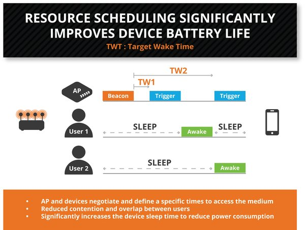
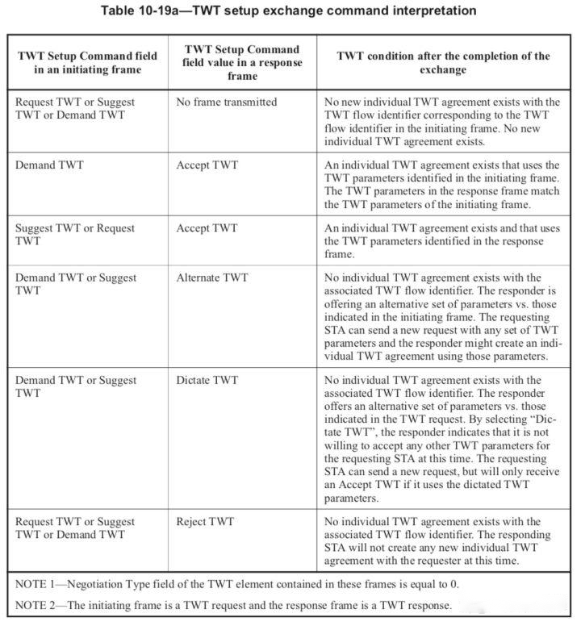
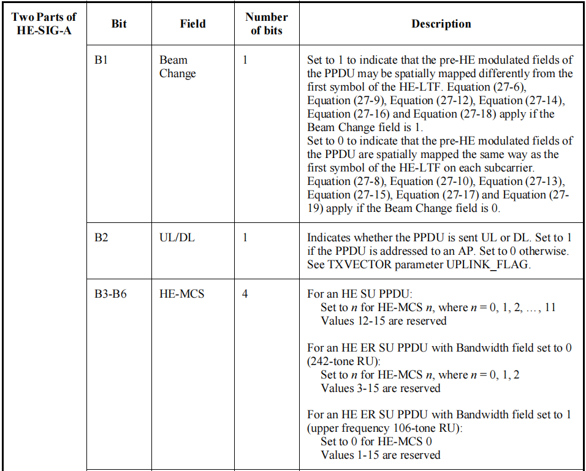
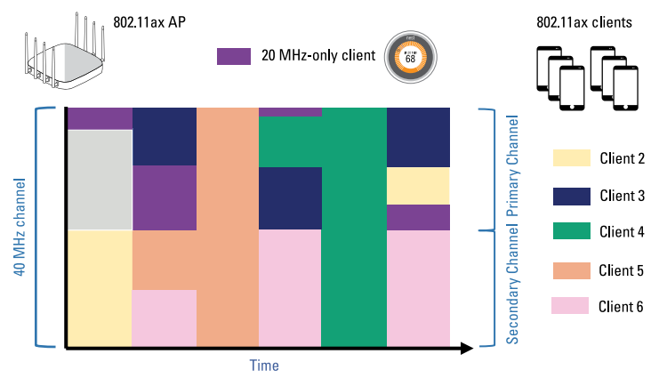
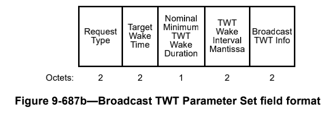

[TOC]

# 序言

关于802.11协议的节能机制，包含了PSM，APSD，PSMP以及SMPS。在802.11ax中，为了在速率提高的场景下，降低所花费的功耗，协议采用了一种新的节能机制TWT（Target Wake Time）。TWT首先是在802.11ah中被引入的，在802.11ax中又经过一些改良。本文就针对于TWT技术做一个介绍。

本文参考：

- [802.11ax fundamentals: Target Wake Time (TWT)](https://www.commscope.com/blog/2018/802.11ax-fundamentals-target-wake-time-twt/?utm_source=ruckus&utm_medium=redirect)

- [CTS 164: 802.11ax Target Wake Time](https://www.cleartosend.net/802-11ax-target-wake-time/)

- [Aruba 802.11ax White Paper]()

# 简介（Target Wake Time）

  TWT定时唤醒机制（**Target Wake Time**，**TWT**）首次出现在802.11ah “Wi-Fi HaLow”标准中，其用于支持大规模物联网环境下的节能工作。随着IEEE 802.11ax标准的发展，TWT的功能获得了进一步的扩展，这使得IEEE 802.11ax标准能够更加优化设备的节能机制，提供更可靠，更节能的传输机制。在802.11ax中，TWT机制在ah的基础上，已经被修改为支持基于触发的上行链路传输，从而扩展了TWT工作的范围。

  在TWT中，终端和AP之间建立了一张时间表（该时间表是终端和AP协定的），时间表是由TWT时间周期所组成的。通常终端和AP所协商的TWT时间周期包含一个或者多个beacon周期（总体时间比如几分钟，几小时，甚至高达几天）。当终端和AP所协商的时间周期到达后，终端会醒来，并等待AP发送的触发帧，并进行一次数据交换。当本次传输完成后，返回睡眠状态。每一个终端和AP都会进行独立的协商，每一个终端都具有单独的TWT时间周期。AP也可以将终端们根据设定的TWT时间周期进行分组，一次和多个终端进行连接，从而提高节能效率。

  

  如上图所示，User 1和User 2分别和AP协定了两个TWT时间周期，分别为TW1和TW2。终端User 1和User 2默认就工作在睡眠模式下（sleep mode），保持一个较低的功耗。当TWT时间周期到达时，AP会发送一个触发帧（Trigger）给终端，终端进而苏醒并和AP执行数据交换，当数据交换完成后，终端恢复睡眠模式。TWT和传统PSM模式的差别是，终端只在TWT时间开始的时候苏醒，而在PSM模式中，从该beacon周期开始，终端就会通过该beacon帧中的DTIM信息，观察是否AP是否由缓存自己的数据帧，如果有的话，那么就保持苏醒，直到接收完成后，才恢复到睡眠模式。在上图中，如果是传统的PSM的话，若本轮beacon帧中提示有User 1的信息，那么其不会在TW1时间内睡眠，会保持苏醒，直到数据交换完成后，才恢复睡眠。

  # 三种工作模式

  ## Individual TWT

  该模式下终端会和AP协商特定的TWT时间，该时间会被存放在AP的时间表中。终端会在特定的时间醒来并和AP进行帧交换。每一个终端仅仅直到自己和AP协商的TWT时间，不需要知道其他终端的TWT时间。Individual TWT还有多种工作模式，比如说显式工作模式。

  其大致工作流程如下：

  1、终端想要建立一个TWT连接，其会将自己的节能调度信息告知给AP

  2、AP将会分配TWT周期，并将该周期反馈给终端

  3、终端会在指定的TWT周期时苏醒，并和AP进行数据帧交换

  4、在本轮交换中，会分成显式和隐式两种工作模式

  ①、显式工作模式

  在本次数据帧交换中，AP会显式告诉终端，下一轮的TWT周期

  终端会在新的指定的TWT周期时苏醒，并再一次和AP进行数据帧交换

  ②、隐式工作模式

  在本次数据帧交换中，AP不会告诉终端，下一轮的TWT周期 终端会自己计算出下一轮的TWT周期（通过在当前TWT周期上增加一个特定的时间） 终端会在自己计算的TWT周期时苏醒，并再一次和AP进行数据帧交换

  

  如上图所示，终端会在苏醒的时候，首先和AP发起一个TWT建立请求，终端和AP协商一个TWT时间（即图中Negotiate a schedule），当协商完成后，终端就进入睡眠状态。在该图上，AP发送Beacon时，也会包含了公开的TWT信息，在Individual TWT工作模式下，该信息终端时不需要的。终端一直保持睡眠状态，直到TWT时间到达。终端苏醒，并接收AP的触发帧，即TWT Trigger。当终端接收到该触发后，其会和AP进行数据帧交互。于此同时，AP会告知终端下一次的TWT时间（在显式TWT中，睡眠间隔是逐次设定的），终端会在新的TWT时间上，定时苏醒，并执行数据帧交换。TWT的一次苏醒间隔有可能是小于一个beacon周期，也有可能是大于一个beacon周期的，相比于传统的PSM，APSD之类的节能方式，更加具有一般性。

  

  终端和AP可以关于TWT时间周期进行协商，终端可以要求取消TWT参数，或者向AP请求特定的TWT时间。如果AP统一终端的请求，其会反馈“Accept TWT”。还有多种协商的具体参数，可以参考上图。

  ## Broadcast TWT

  广播TWT机制是一种由AP负责管理的工作机制。在该机制下，TWT时间周期是由AP宣告，通常AP会在每一个beacon帧中宣告本轮的TWT时间周期。在一些特殊的情况下，AP也会在其他的管理帧中宣告，比如Association帧，Reassociation帧或者Probe Response帧等等。我们需要注意在Broadcast TWT中，存在加入组和离开组的交互动作，终端需要向AP申请加组才可以执行Broadcast TWT，这个加组交互动作也是通过在终端和AP交换管理帧中，通过携带TWT elements完成的。当终端完成加组后，终端会按照最近接收到的TWT时间周期进行工作，此时这一类型的终端也被叫做“TWT Scheduled STA”，AP被称为“TWT Scheduling AP”。终端在TWT时间周期到达后进行苏醒，AP会发送广播的触发帧，发现哪些终端正在处于苏醒状态（加组后的终端们），并向这些终端发送数据帧，这里由于是广播通信，所以只有AP向节点发送。当AP发送完成后，终端恢复到睡眠状态，直到下一次广播TWT时间到达。通常，这种广播TWT中的时间间隔，我们也称为“TWT SP (Service Period)”。

  

  如上图所示，AP会在Beacon帧中，进行TWT Broadcast时间周期（即TWT SP时间）的宣告。终端们苏醒并接收该Beacon信息。然后在对应的TWT时间到达时，对应的终端们会提前苏醒，接收AP发送的TWT trigger，以及AP发送的下行数据帧，在此过程中，AP也由可能发送新的一次的TWT Broadcast时间周期（即TWT SP时间）。终端接收完成后，进入睡眠状态，并在新的TWT SP时间到达时，再次苏醒，以后以此类推。

  ## Opportunistic PS

  机会PS模式和前面两种工作模式是类似的，但是没有AP和节点的协商过程。AP会在每一个Beacon内，公开宣告一个TWT时间。任意终端可以选择在这个公开TWT时间内进行苏醒，并和AP执行数据帧交换。这个交换可以是单个节点的，也可以是采用OFDMA机制进行交换。

  

  如上图所示，AP在Beacon帧中宣告了一个公开的TWT时间，任意终端都可以直到该TWT时间。当该TWT公开时间到达后，AP会发送触发帧，此时苏醒的节点可以和AP进行交互，并执行数据帧的交换。在图中，由多个节点苏醒，从而触发了一次OFDMA类型的数据帧交互。

  # 其他节能机制

  802.11ax协议对于功耗这一面是很关注的，除了TWT以外，还包含了一些其他的特殊设计，用以节能，并延长终端的电池寿命。这些在IoT场景中都是非常重要的。

  - **选择性的接收数据帧**：在传统的802.11中，节点需要接收所有的数据帧，即使该数据帧不是自己的，那么也需要接收完成后，检查MAC地址（即BSSID），判断之后才可以丢包。接收无用的数据帧也是要耗费能量的，所以在802.11ax中，节点可以在数据帧的物理层头部就判断，该帧是不是要进行接收的，如果不是需要接收的，那么就可以停止接收，从而节约能量。

  在802.11ax协议中，这一点的实现是基于新的物理层头部的：

  

  如上图所示，为一个802.11ax的帧结构，我们红色标出的位置HE-SIG-A是其物理层头部的一部分。在节点接收过程中，节点需要首先接收物理层头部，并完成解调，获取了相应的信息后，才可以进行数据部分的解调。在物理层头部HE-SIG-A字段中，有两个字段我们需要关注：

  

  

  

  **Uplink/downlink字段（即UL/DL）**：终端可以通过物理层头部的UL/DL字段知道这个帧是由AP发送给节点的，还是由别的节点发送给AP的。由于当前的无线网络基本都是工作在基础架构模式，或者扩展服务集模式，总之该模式都是有中心节点AP的，任何的流量转发都需要经过AP，节点和节点直接无法直接交换数据。这种情况下，节点要不是向AP发送，要不是接收AP的数据帧。所以当一个节点通过HE-SIG-A中的UL/DL字段判断该数据帧是其他节点发送的话（即UL状态），那么其就不需要接收，反之如果是DL状态的话，那么就表示是AP发送的下行帧，所以需要接收。

  > Remark：由于下行数据帧有可能是广播或者组播，也有可能是单播，所以无论下行数据帧是不是自己的，节点都需要接收。节点只有在识别到是其他上行流量时，才会停止接收。

  **BSS Color字段**：在多AP的场景下，节点仅仅会接收感兴趣的AP（比如本地关联的AP）信息，如果非感兴趣的下行信息，其是可以不接收，从而节能的。BSS Color字段也是在物理层头部HE-SIG-A中（如上图所示）。在802.11ax中，不同的AP可以通过BSS Color字段来进行识别，每一个AP都有预设的BSS Color，节点也知道不同AP对应的BSS Color。节点如果识别到非感兴趣的帧，那么会停止接收帧，并返回睡眠模式。

  - **发送功率限制**：在OFDMA接入模式中，AP会通过发送Trigger帧通知不同节点，其上行传输所用的功率和MCS。一方面是为了优化接收信号的性能，即为了执行OFDMA，需要不同节点的信号到AP处近似相等，否则会出现远近效应。另外一方面，可以优化能耗，让部分节点不需要满功率发送，从而节能。

  

  如上图所示，在Trigger帧中的User Info Field中，UL MCS指示了节点发送时候的速率，已经UL Target RSSI指示了AP端期望接收的功率，节点根据该位计算出合适自己的发送功率。由于这种功率调节机制，节点不会一直以满功率进行传输，从而进行节能。

  - **OMI模式（Operating mode indication）**：我们之前介绍过OMI模式，该模式节点和AP之间会协定传输参数，以及是否采用OFDMA形式进行传输。OMI还分成“Receive operating mode”（ROM），“Transmit operating mode”（TOM）。

  

  上图给出了OMI模式中可以控制的参数。通过OMI可以控制数据传输时的信道带宽，空间流数目，工作模式，OMI可以限定工作模式，对于IoT场景而言，节点可以用OMI来限定发送和接收数据时的带宽以及空间流的数目，从而实现节能的目的。

  - **20MHz-only工作模式**：支持该模式的设备只能够以20MHz的方式，接入2.4GHz或者5GHz频段的AP，具体时接入主信道（即Primary Channel）。限定节点的工作带宽，可以减少大带宽信号所使用的功率，从而实现节能。

  

  

  如上图所示，我们认为这里有4个20MHz的信道，对于接入者而言，只有1个主信道（即Primary Channel）是信道3，然后还有3个从信道（secondary Channel)。当节点启用20MHz-only时，其只会在Primary 20MHz信道上工作，该工作可以是采用OFDM技术，也可以使用OFDMA技术，即占据部分的子载波。在Secondary Channel上，节点不会进行工作。

  # 帧格式

  

  

  

  

  

  

