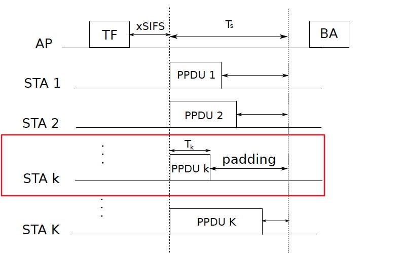
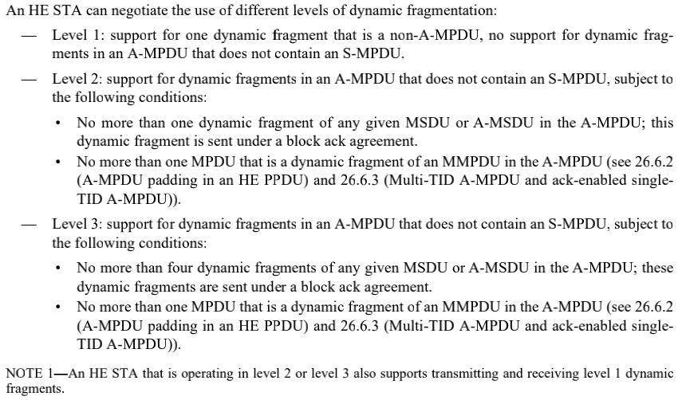

[TOC]

# 序言

前面已经介绍过了UL/DL-OFDMA的接入机制。下行接入是AP分配的，上行接入过程包含两种：(1) 允许竞争的UORA; (2) 无竞争，完全是由AP分配的模式。

无论在上行还是下行的OFDMA接入机制中，都可以简单概述成：先发送一个TF帧，AP会在这个TF帧中指定用户所占据的RU，或者指定特定的RU让用户做竞争接入。

该TF帧会启用TXOP机制，换言之，它会设置信道在一定时间内为NAV状态，从而让AP获得更高等级的调度权。然而，一个基本问题就引发了，这个TXOP时间是怎么设置的，有没有什么限定？因此，本文简单讨论了这个一个问题，以及该问题所需要引入的新技术，动态分片技术。

# UL/DL-OFDMA接入过程

首先回顾下在802.11ax中的UL-OFDMA过程，ax中的接入过程最简化可以为三个帧，TF，UP-OFDMA PPDU，MU-BlockACK，如下图所示：

在首先发送的Trigger帧中，会开启一个TXOP时间，该时间内，所有的节点都被强制设置为NAV，即虚拟载波监听状态，无法主动的竞争信道。Trigger帧是一个触发传输的帧，其包含了节点上行传输所需要的设置信息，包含了MCS和传输功率控制，如下图所示：

其中的User ID对应用户的AID，对应AID的用户会在该资源块RU上进行对应的上行传输，可以通过AID=STA来指定特定节点，也可通过AID=RA（具体可以是0，也可以是2045）来指定该RU用于随机接入。

每一个RU才还被指定了MCS以及其对应的数据流数目，即SS Allocation，以及MCS，这是802.11协议中首次引入的机制，AP可以控制节点的发送速率。

# UL/DL-OFDMA的TXOP时间设置

TXOP机制是首次在802.11e中被引入，其允许“一次竞争，多次传输”。即在节点竞争胜利后，可以持续占用信道一段时间。标准的TXOP时间是和数据包的业务优先级AC有关的，并在802.11e中是给出了默认值，如下图所示（不同协议版本的TXOP时间设置不同）：

在802.11后期的发展中，TXOP成为一种机制。在一些其他用处下，比如802.11ax中的OFDMA接入过程，其TXOP的时间不是按照上图的默认机制，而是和传输数据包的大小有关。

从上述协议可以得到，**TXOP时间=TF+CTS+PPDU+ACK**

该TXOP时间的核心设置为一次对应传输的PPDU时间（即HE_TB_PPDU）。

- 下行：由于传输方是AP，所有AP知道待传输的数据包大小，并且所有的RU传输速率都是已经设定好的，所以该PPDU传输时间是一个固定值，可以设置。
- 上行：因为在传统的802.11中，AP是无法知道节点上行数据包的对应情况的。传统的802.11中，AP不仅预知节点的数据包情况（比如包大小之类），同时期物理层传输参数也是无法预知的（比如传输的速率）。

那么在802.11ax中，需要引入新的机制，已知一些信息才可以确定性的设置对应传输的TXOP时间。所以协议中有两个设置：

1. OFDMA传输时，AP发送Trigger帧，指定各个RU对应的MCS和NSS，确定传输速率。
2. 通过BSR，BSRP机制，AP获取节点对应的buffer信息，确定数据包大小。

基于以上两点，AP可以设置该传输所需要的PPDU时间。

# 动态帧分片（Dynamic Fragmentation）

除了基于BSR机制的上行传输机制外，还有一种基于随机接入的上行机制UORA。

在UORA情况下，假设AP设置的时间为A。而节点上行传输所需要的时间为B。那么会分两种情况：

- 如果A>B，可以实现，但是效率低下，节点传输完自己数据包之后，需要padding，充填一些冗余数据，将时间填充满A。
- 如果A<B，AP给出的时间不够一个数据包传输的，在传统的TXOP中，是不传输（也就是TXOP最后的时间片段，是否能够传输一个数据帧）。在802.11ax中，这不仅仅是一个效率问题了，而是出现这种情况，一个上行帧都无法传输出去，造成的问题比较大。

所以在802.11ax中，为了解决该问题，引出了一个新的设计即为动态帧分片技术。

在802.11ax中，传输都是由AP同意调度的。无论上行还是下行，AP都会为节点分配好传输所用的RU数目，传输速率MCS之类。

然而，在OFDMA传输过程时，传输时间也是由AP设定的。标准情况下，AP可以通过BSR机制，基于节点的待传数据包大小设置。然而，在UORA传输时则无法准确设置。此时有可能会出现，节点待传数据所需时间会大于TXOP时间，比如节点传输需要30ms，但是txop时间只有20ms，此时我们就需要引入动态帧分片。动态帧分片是针对于传统的静态帧分片技术做个补充。

其实除了上述这一个角度，我们可以理解动态帧分片技术的必要性。我们还可以换一个角度理解，也就是结合帧聚合技术理解动态帧分片。

如上图所示，如果TXOP时间较长，那么多余的部分是需要padding的。这一块padding能不能传输内容呢？在最传统的802.11中是不可以的，但是在帧聚合模式下，这是一个特例。

如果物理层传输的PPDU对应的是一个A-MPDU的话，也就是一个聚合帧的话。那么在传输过程前，节点可以决定我的聚合长度是多少。此时，如果节点一直传输的TXOP时间，并且剩余所需要的Padding的时间，那么此时节点可以利用动态帧分片技术，切出来一个短帧来补充这一块需要的Padding片段，从而提升效率。从这个角度而言，动态帧分片也是非常有价值的一个设计。

在协议中，动态帧分片一共包含3个等级：

这三个实际上是针对不同场景的帧分片，比如说针对于非帧聚合模式下，以及针对于帧聚合模式下的帧分片。
