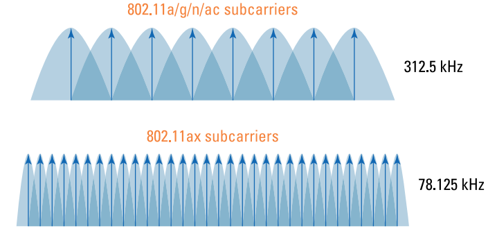
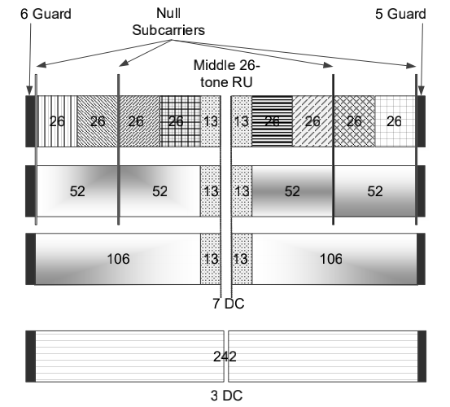
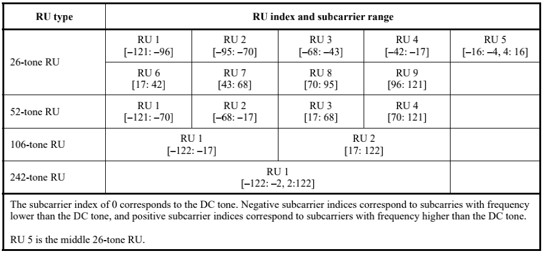
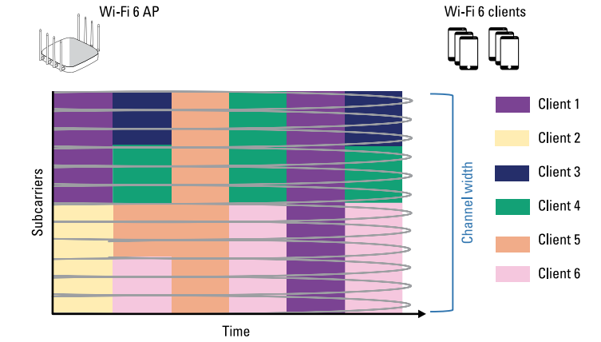

[TOC]

# 序言

参考资料：

[What are OFDMA Resource Units in 802.11ax?](https://www.extremenetworks.com/extreme-networks-blog/)

[Wi-Fi_6_FD_Extreme_Networks_Special_Edition](/books/Wi-Fi_6_FD_Extreme_Networks_Special_Edition.pdf)

[Draft P802.11ax_D8.0.pdf](/books/Draft_P802.11ax_D8.0.pdf)第27.3.2节(Subcarrier and resource allocation)

[OFDM and OFDMA Subcarriers – What Are the Differences?](https://www.extremenetworks.com/extreme-networks-blog/ofdm-and-ofdma-subcarriers-what-are-the-differences/)

# 简介

无线和有线通信不同。有线通信中信息是承载在线缆上，通过高低电平来标识不同的信息010010。但是在无线通信中，信息的载体就变成了高频信号，这种将信息加载到某个高频信号进行传播的过程就叫做载波调制，而承载着信息的高频信号，我们也称之为载波。拿日常生活中的例子来说，Wi-Fi通信类似快递送货，载波就像是送货的小车，发送方通过载波调制将货物(信息)放到小车上再送达到接收方。

不过这些频段不仅Wi-Fi可以用，其他短距无线传输技术比如RFID、蓝牙等，也都可以使用，所以干扰也很多。

在Wi-Fi 4/5，载波调制用的是正交频分复用OFDM（Orthogonal Frequency Division Multiplexing）技术。

OFDMA技术是802.11ax引入了新的物层机制，其可以让多个用户并行进行接入。

由于引入了OFDMA技术，所以需要定义时频资源块（Resource Unit）的概念，这些时频资源块都是彼此正交的。802.11ax中的OFDMA实际上是借鉴LTE的，但是没有LTE资源块那么复杂（比如RE，RB，CP，REG，CCE这些），802.11ax中仅仅有RU（Resource unit）的概念。

以上图为例，左图是OFDM的工作模式，右图是OFDMA的工作模式。图中一共有4个节点，分别以4种颜色进行标识。图中横轴为时域，纵轴为频域（即对应不同的子载波）。

- **OFDM工作模式**（左图）：用户是通过不同时间区分出来的。每一个时间片段，一个用户完整占据全部的子载波，并且发送一个完整的数据包（如图中红色部分标出的WLAN Packet）。
- **OFDMA工作模式**（右图）：用户是根据时频资源块RU区分出来的。首先将整个信道的资源分成一个个小的固定大小的时频资源块，这个时频资源块也就是RU（Resource unit）。在该模式下，用户的数据是承载在每一个RU上的，故从总的时频资源上来看，每一个时间片上，有可能有多个用户同时发送。

OFDMA相比OFDM一般有两点好处：

- **资源的更细腻分配**。特别是在部分节点信道状态不太好的情况下，可以根据注水定理的思想（即根据信道质量分配发送功率），来更细腻化的分配信道时频资源
- **能够更好的提供QOS**。因为初始的802.11是占据整个信道的，如果有一个QOS数据包需要发送，其一定要等之前的发送者释放完整个信道才行，所以会存在较长的延迟。在OFDMA的情况下，由于一个发送者只占据部分信道，所以能够减少QOS节点接入的延迟。

拿小车来举例，OFDMA相当于在小车中划出专门的隔间，通过调度每个隔间放置不同用户的货物，这样一次可以为多个接收方送货。

OFDMA没有多天线的要求，在单天线条件下，也可以做到OFDMA。

资源片段会根据需求被分配到各个用户上。这里要区分上下行，如果是下行的话，那么AP直接发送一个数据帧即可，当然，该帧内部的资源映射关系是提前告知用户的，Wi-Fi帧中是通过Trigger帧告知。用户实际上可以解调所有的信息，即全部片段都可以解调，然后根据映射关系，选取自己的信息即可。安全性是通过数据层的加密完成的。

上行的话，Wi-Fi是允许上行的OFDMA。OFDM有一个问题就是PAPR，峰均比，也就是所有的子载波由于是周期成倍数关系的，所以如果所有子载波都是加载相同数据的时候，出来的峰值就是所有子载波上单位峰值的叠加。如果大家都是1，那么这个1冲到很高，如果大家都是0，那么就是0，换言之是0（打个比方，虽然传输的时候是用双极性的，所以不会有0的存在）。（这样峰值和均值的区间很大，就会对放大器的工作区有要求)

- LTE子载波多，一共2048个，所以峰均比空间大，最后就没有采用OFDMA做上行。LTE的上行是SC-FDMA。主要原因是PAPR高，但是不是技术不可行，是相应实现时候，PA需要更高的成本，以及会产生更高的功耗。
- Wi-Fi子载波最多256个（上述都是在20MHz信道带宽下），所以峰均比还可以承受，所以上行可以允许OFDMA。

目前OFDMA在Wi-Fi 6里面是一次性添加了上行和下行，下行在整个接入过程中很简单，AP抢到的信道，然后发送即可。上行接入的时候包含了有两种接入方式，一共是基于竞争的（就是UORA），一种是基于非竞争的，也就是基于BSR的，缓存情况，根据节点的缓存情况，AP进行资源分配，然后告知。其实搞两种接入方式也是和LTE类似的，LTE中在PRACH信道上也有两种接入模式，基于竞争和基于非竞争，基于竞争的是随机选择竞争序列（也就是竞争所采用的Code），而非竞争的则是通过eNodeB指定。这点上LTE和WiFi 6在框架上是类似的。

在这里还需要注意的一个是，OFDMA和CDMA一样，存在远近效应。其含义是接收方，也就是AP，在接收信号的时候，需要所有节点发送到AP处的信号功率，近似相等。如果功率差异过大，那么就不能够很好解调了。（功率差异大就是用SIC技术，而不是OFDMA技术了）。

所以在上行发送的时候，触发帧实际上包含了三个重要信息，1）资源分配，2）发送速率指定，3）功率指定。通过以上技术，在OFDMA的场景下，Wi-Fi基本和LTE能够做到的差不多了，精准的频谱资源分配。

# 子载波

在传统的802.11a/g/n/ac中，采用了正交频分复用（OFDM，Orthogonal Frequency Division Multiplexing）作为单用户传输的物理层技术。

在802.11ax中，引入了一种新型的基于OFDM的OFDMA技术，其是OFDMA对应的多用户版本，其将信道划分成更小的时频资源单元，即RU（Resource Unit）。

通过OFMDA的划分，多个用户可以并行进行传输，提高信道利用率。

每一个RU内的数据和导频，在OFDMA子信道内都是相邻而且连续的。

OFDM和OFDMA技术的实现是通过快速傅里叶变换（FFT）和快速傅里叶逆变换（IFFT）来构成的。

在OFDM中，信道被分成了多个子载波，每一个子载波是正交的，不会互相干扰，所以其子载波之间是没有保护间隔的。

在OFDM中，也会分配一个子载波作为Null子载波，其不承载任何数据，用来防止载波间干扰（Inter-Carrier Interference ，ICI）。

OFDM和OFDMA都通过一个数学函数（快速傅里叶逆变换）IFFT将信道划分为子载波。

如下图所示，802.11n/ac 20MHZ信道带宽包含64个子载波。其中52个子载波用于承载调制数据（data subcarriers），4个用于导频载波（pilot subcarriers），8个作为保护频带（grard bands）。每个OFDM子载波间隔为312.5KHZ，也就是3.2us。OFDM子载波可以称为OFDM subcarriers或者OFDM tones。

在802.11ax中，相同的信道带宽采用的FFT的点数增加4倍。比如原来20M信道采用64点的FFT（即64个子载波），现在就变成了256点的FFT（即256个子载波）。

OFDMA子载波间隔为78.125KHZ，也就是12.8us。因此如下图所示，由于存在78.125KHZ的间隔，OFDMA 20MHZ通道总共包含256个子载波（tone）。

> 更窄的子载波间隔，允许会提供更高的频域分辨率，提升均衡能力，并且增强信道鲁棒性

类似于OFDM一样，OFDMA存在三种类型的子载波：

- **数据子载波**（Data subcarriers）：这些子载波用于承载数据，其传输速率是在802.11ac的基础上（即在802.11ac的MCS上），引入了两个新的MCS（Modulation and Coding Schemes），包含1024-QAM这种更高的调制阶数。
- **导频子载波**（Pilot subcarriers）：这些子载波用于发射器和接收器之间的同步，并且不携带任何调制数据。
- **未使用的子载波**（Unused subcarriers）：剩余未使用的载波主要用于保护子载波（gard carriers）或者空子载波（null carriers），以抵抗来自相邻信道或相邻子信道的干扰（即抵抗ICI）。

利用OFDMA，这些子载波组合在一起成为分区子信道，也成为资源单元（RU）。通过将信道进行进一步的细分，发送到多个用户的比较小帧可以同时传输。在OFDMA信道内，每个资源单元内的数据和导频子载波既相邻又连续。

>为了兼容早期的其他802.11协议，802.11ax仍将支持OFDM。在802.11ax中，管理帧和控制帧仍将使用802.11a/g/n/ac的OFDM技术，以及以基本的传输速率进行传输（一般就是最低传输速率），这保证了其他早期的802.11终端能够互相理解。此时管理帧和控制帧都是采用整个20MHz信道，利用整个64个子载波进行传输。OFDMA技术仅仅用于802.11ax AP和802.11ax终端之间的数据帧交互。

在802.11ax中，20M信道一共有256个子载波，而实际资源块RU总共只使用了234个，两者相差了22个子载波。这些子载波是用来做保护间隔的：包含了DC，Null Sub-carriers以及Guard Sub-carriers，如下图：

图中分别列举了RU为26,52,106个子载波的情况，我们具体解释如下：

- **DC保护**：以**中心子载波**为核心，一共有7个子载波作为DC保护的，即DC的保护带宽一共是7*78.125kHz=546.875kHz，与原来的一个DC保护（即312.5kHz）是比较接近的。

- **Guard Sub-carriers**：保护子载波这里指的是**信道之间的保护子载波**了（比如20MHz信道之间的保护），如上图所示，其选取了左边的6个子载波以及右边的5个子载波作为保护，这点设计是和802.11a的载波设计是一样的，只是子载波的带宽不一样而已。

- **Null Sub-carriers**：在一些早期的书里面，比如《MIMO-OFDM Wireless Communications with MATLAB》，其中是将Guard Sub-carriers和Null Sub-carriers等价看待的。不过在802.11ax中，Null子载波是指的**RU之间的保护间隔**，一般是1个子载波。

下面这张彩图可能更清晰一些：

以RU为26所示，这里一共损耗了6+1+1+7+1+1+5=22个子载波。

最后介绍一下在802.11ax中，导频子载波（Pilot）的设计。

- 导频子载波是用来做信道估计的，利用估计出的信道系数完成解调的工作。

- 由于802.11ax还是一个分布式接入的工作，所以**Pilot是包含在每一个RU内部的**。

- 在802.11中，始终是用特定的子载波作为导频子载波，从而完成信道估计的功能，在802.11ax中，导频子载波的分配如下：

其中红色的直线即代表导频子载波的位置，代表的是子载波序号，其导频资源是均匀分布在整个信道上的。

如上图所示带宽为20MHZ，RU为26时，-116号子载波为导频子载波，102号子载波为导频子载波。也就是每个RU的第6个子载波为导频子载波，倒数第七个为导频子载波。

在RU为26个子载波的情况下，每一个RU中都包含了2个pilot，在RU为52个子载波的情况下，每一个RU包含4个pilot。通过这些pilot的设置，在传输过程中，接收方才可以有效地估计信道，并完成解调的工作。

# OFDMA资源块RU（Resource unit）

在802.11ax中，一个最小的时频单位为RU。与LTE中的RE（Resource Element）和RB（Resource Block）不同，LTE中的RE和RB都是一个固定值。

在802.11ax中RU是一个相对的概念，即存在很多种不同大小的RU，如下图所示：

图中，一共定义了6中RU类型，分别是26，52，106，242，484以及996个子载波。

正交频分多址（Orthogonal Frequency-Division Multiple Access*，*OFDMA）作为主要的802.11ax增强功能，其是OFDM数字调制技术的多用户版本。 OFDMA将信道细分为较小的资源单元RU。通过OFDMA的资源细分，多个客户端可以通过占据不同的RU资源进行并行传输。

一个20MHz的OFDMA信道包含了256个子载波（Subcarriers，或者称为Tones）组成。这些子载波组成了一些子信道，我们称一个子信道为一个资源单元（RU）。如上图所示，当20MHz信道时被细分时，802.11ax终端可以使用4种不同大小的RU单元，分别包含26个子载波，52个子载波，106个子载波和242子载波，大约相当于2MHz，4MHz，8MHz和20MHz信道带宽的分别。802.11ax的AP决定了在一个20MHz信道内可以使用多少个RU，以及RU形成的不同组合。

> 本人理解的是存在不同类似RU共存的情况，比如在20M带宽情况下，2个52-subcarrier RU和1个106-subcarrier RU是可以共存的。这样设计的好处在于可以更有效的分配频率资源，比如在20M的信道条件下，一共可以存在9个26-subcarrier的RU，故需要9个人竞争才可以占据全部信道，否则就会有资源浪费（在802.11ax中，每一个发送者每次只能够竞争一个信道）。所以在发送者数量不足的情况下，只有通过不均等的分配，才可以更加有效的利用信道资源。

802.11ax AP可以将整个信道分配给一个客户端，也可以利用OFDMA技术将信道分给多个终端同时接入。

例如，802.11ax AP可以使用8 MHz的带宽与一个802.11ax终端通信，同时使用4 MHz的带宽与另外三个802.11ax终端通信。

这些通信过程可以是下行链路，也可以是上行链路。

在上图示例中，802.11ax AP首先向Client 1和Client 2发送下行数据。

在第一时刻，20MHz的信道通过OFDMA技术被划分成了两个子信道。在OFDMA技术中，20MHz信道包含了256个子载波，Client 1和Client 2分别占据106个子载波，这些子载波互相没有交叠。

在第二时刻，802.11ax AP向Client 3，Client 4，Client 5和Client 6发送下行信息。在此时，信道被划分成4个子信道，分别占据52个子载波。

在第三时刻，802.11ax AP使用整个信道发送下行数据帧给Client 5，此时一共使用了242个数据子载波，其可以有效的利用整个20MHz的信道。

在第四时刻，AP使用两个子信道，分别是106个子载波向Client 4和Client 6发送数据。

在第五时刻，AP在此向单个终端（即Client 1）发送下行数据，其占据整个20MHz信道，包含242个数据子载波。

在第六时刻，AP同时向Client 3，Client 4和Client 6发送下行数据。此时，信道被划分成3个不等大小的子信道，其中Client 3和Client 4分别占据52个子载波，Client 6占据106个子载波。
