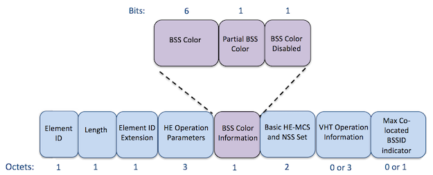
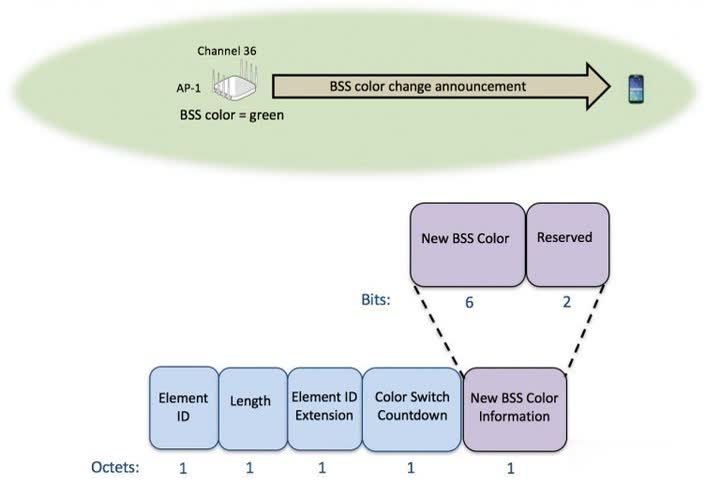
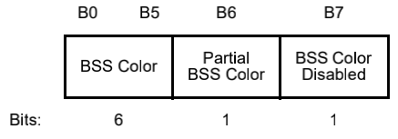
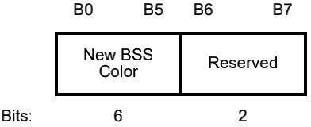

# BSS color

## 序言

参考资料：

- [What Is BSS Coloring In 802.11ax?](https://www.extremenetworks.com/extreme-networks-blog/)
- [What is BSS Color in 802.11ax?](https://www.extremenetworks.com/extreme-networks-blog/what-is-bss-color-in-802-11ax/)
- [How Does BSS Coloring Work in 802.11ax?](https://www.extremenetworks.com/extreme-networks-blog/what-is-bss-color-in-802-11ax/)
- 802.11-2016.pdf
- Draft P802.11ax_D8.0.pdf

## 介绍

BSS Coloring是最初在802.11ah中引入的一种机制，用于为每个BSS分配不同的“颜色”。该技术目的是增加在密集环境中，无线网络的系统容量，增加BSS之间的频率重用。然而，当前的802.11的MAC层机制，其会导致一个BSS的设备会被同频道的另一个BSS影响，无法同时进行传输，从而对于网络容量没有提升。

在802.11ax中，BSS Coloring是一种用于解决由于重叠基本服务集（OBSS）提升空间重用率的方法，减少因为重叠BSS导致的MAC层竞争开销。BSS Coloring的目标是提升空间复用，同时不会因为BSS间的干扰而导致节点间PHY层传输速率的降低（即降低MCS值）。802.11ax设备通过向PHY头部添加字段（即BSS Coloring字段）来区分BSS，节点在竞争时，根据检测到物理层头部的BSS Coloring字段来分配MAC层的竞争行为。若BSS Coloring字段信息相同，那么代表在同一个BSS内(intra-BSS)。若BSS Coloring字段信息不同，那么代表这里是重叠覆盖区域，在多个BSS间(inter-BSS)。 在传统802.11中，若在BSS间(inter-BSS)，当节点检测到信道忙时，需要推迟自己的传输，直到信道空闲才可以发送。在802.11ax中，引入了自适应CCA机制(adaptive CCA)。通过提高BSS间(inter-BSS)信号检测阈值，同时保持BSS内(intra-BSS)的较低信号检测阈值（两个阈值，大约4dB左右的差值），来减少MAC层竞争时的竞争问题，提升MAC层效率。

BSS Color特性如下：

- STA可以使用信道接入规则（26.10 Spatial reuse operation）
- 降低能量消耗
- 更新NAV

## **什么是802.11ax中的**BSS Coloring技术？

802.11协议是采用CSMA/CA作为MAC层的协议，其采用的是半双工通信机制，这表示在同一个时间只有一个无线电设备可以在网络上进行传输。如果一个802.11终端检测到任意一个802.11终端的传输信号(即PHY层的Header)，其会推迟传输。我们称多个AP和客户端在同一个信道上进行部署，并执行竞争传输叫做OBSS(具有重叠的基本服务集)。在OBSS中，我们描述这种同信道的干扰为co-channel interference(CCI).

信道复用的核心问题是最小化空口传输时间并减少由于OBSS场景导致的性能下降。 802.11ax修正案基于提升空间复用的思想，提出自适应的CCA机制(adaptive clear channel assessment, adaptive-CCA)来对于信道进行检测。

BSS Coloring，是用于识别重叠基本服务集（OBSS）的方法。 其最先是在802.11ah-2016修正案中定义，现在也沿用到了802.11ax中。 BSS Coloring是一个字段，标识了BSS的ID。当多个无线终端在同一信道上传输时，802.11ax无线电能够使用BSS Coloring字段区分BSS。

BSS Coloring的信息是同时被添加在PHY层和MAC层中的。在802.11ax PHY头部的Preamble中，其SIG-A字段包含6个Bit的BSS Coloring信息字段，如下表所示，该字段可以识别多达63个BSS。

| bit0   | 1           | 2     | 3-6    | 7    | 8-13      | 14       | 15-18         | B19-B20   | ...  |
| ------ | ----------- | ----- | ------ | ---- | --------- | -------- | ------------- | --------- | ---- |
| Format | Beam change | UL/DL | HE-MCS | DCM  | BSS Color | Reserved | Spatial Reuse | Bandwidth | ...  |

在802.11管理帧中也可以看到BSS Coloring信息(如上图所示)。在Beacon帧中的HE Element中，包含BSS Coloring的子字段。其也是6个Bit的BSS Coloring信息字段，可以标识63个BSS。

在802.11ax中，MAC层的竞争取决于检测到的BSS Coloring。其将CCA的阈值和BSS Coloring信息关联起来(即adaptive-CCA)，从而提升空间复用能力。让节点可以忽略OBSS间的传输，可以在此时同时进行传输，从而提升信道利用率。802.11ax修正案定义了两种的空间重用模式，一种称为基于OBSS PD的空间重用，另一种称为基于SRP的空间重用。

## BSS Color原理

基本服务集（BSS）是任意802.11网络的基础拓扑。构成BSS的元素包含，包括1个AP和多个节点。在多个节点在信道传输时，802.11ax通过BSS Coloring字段来区分BSS。若BSS Coloring信息相同，那么是BSS内的传输，若BSS Coloring不同，那么是BSS间的传输，即来自于OBSS内部的传输。

对于802.11ax的AP，其如果检测到使用相同颜色的OBSS，则它能够更改变其BSS颜色，减少同频干扰。若AP与AP间的BSS Coloring一样，那么这也是一种BSS Coloring的冲突，即颜色冲突。如上图所示，如果802.11ax AP听到来自其他AP或者该AP节点的不同BSS Coloring字段，那么是检测到一次颜色冲突。

另外，如果终端检测到颜色冲突，则该终端会向其关联的AP发送颜色冲突报告。如上图所示，AP-1无法听到AP-2，但AP-1的关联的终端可以听到来自于OBSS区域内，其他不同BSS Coloring的传输，从而向AP发送颜色冲突报告。终端向AP会报告其能够监听到的所有OBSS的BSS Coloring信息。

当AP检测到颜色冲突后，其可以决定改变其BSS颜色。不过改变BSS Coloring的标准和选择新BSS Coloring信息的方法超出802.11ax草案修正案的范围。WLAN供应商目前可以自行制定，例如Aerohive信道选择协议（ACSP）。

AP会通过Beacon告知所有关联在本BSS内部的节点，BSS Coloring的改变。BSS Coloring的改变还可以通过探测响应和重新关联响应帧中进行通知。如上图所示，AP告知节点BSS Coloring的颜色变化，其New BSS Color子字段则包含新BSS Coloring的数值。

## 初始化BSS color

当HE AP开始一个基础BSS（infrastructure BSS）或者HE STA开始一个IBSS或者MBSS，在它发送的第一个**HE Operation element**中，其帧格式如下图所示，设置BSS Color子字段为1~63中的一个值，并且在BSS的存在时间或直到BSS color改变，都需要维持这个值不变。如果选择一个BSS Color，HE STA需要考虑相邻OBSS中BSS color的使用。

其中**BSS Color Information**字段如下所示

**Partial BSS Color**字段为1表示将基于(AID 分配)中定义的BSS颜色的AID分配规则应用于BSS

AID分配规则：

## 禁用BSS color

当HE STA探测到BSS color collision时，发送一个HE Operation element来禁止BSS使用BSS color，设置HE Operation element中的BSS Color Disabled子字段为1来通知该BSS下的其他STA禁止使用BSS Color；否则HE STA设置BSS Color Disabled子字段为0。

> NOTE: 发送了HE Operation element的HE STA不要长时间禁止BSS color，否则会影响其他依赖BSS color的HE STAs的功能。

如果AP接收到的HE operation element中的BSS Color Disabled子字段为1，则：

- non-AP HE STA使用HE PPDU中的Address 1, Address 2, Duration/ID代替RXVECTOR parameters BSS_COLOR和TXOP_DURATION来决定STA是否更新intra-BSS NAV
- non-AP HE STA使用HE PPDU中的Address 1, Address 2代替RXVECTOR parameters BSS_COLOR和STA_ID来决定STA在PPDU持续时间是否进入休眠

## BSS color冲突

**Event Report frame**使用**Action frame body format**，该帧用于响应**Event Request frame**或者是自动发送的。帧格式如下图所示

其中**Category**格式如下图所示

**WNM Action**字段的值如下表所示

| WNM Action field value | **Description** |
| ---------------------- | --------------- |
| 0                      | Event Request   |
| 1                      | Event Report    |
| 2-255                  | 此处省略        |

**Dialog Token**判断是上报还是响应帧

| Dialog Token value | Description             |
| ------------------ | ----------------------- |
| 0                  | 发送Event Report frame  |
| 1                  | 响应Event Request frame |

**Event Report Elements**格式如下图所示，注意，由于对应的是BSS Color事件，则**Event Report Status**为0(Successful)，并且**Event Type**是4（BSS Color collision）或者5（BSS Color in use）,则在事件上报状态后面的字段使用Event TSF, UTC Offset, Event Time Error, Event Report等字段。

Element格式如下如所示，对于BSS Color事件，其中Element ID Extension长度为1个字节。

其中**Element ID**定义如下表所示。

| Element                       | Element id | **Element ID** Extension | Extensible | Fragmentable |
| ----------------------------- | ---------- | ------------------------ | ---------- | ------------ |
| BSS Color Change Announcement | 255        | 42                       | YES        | NO           |

**Event Token**事件令牌：由于BSS Color冲突事件是自动上报的，所以该字段为0

**Event Type**事件上报类型：定义如下表所示

| Event Type | Name                    |
| ---------- | ----------------------- |
| 0          | Transition              |
| 1          | RSNA                    |
| 2          | Peer-to-peer link       |
| 3          | WNM log                 |
| **4**      | **BSS Color Collision** |
| **5**      | **BSS Color In Use**    |
| 6-220      | Reserved                |
| 221        | Vendor Specific         |
| 222-255    | Reserved                |

**Event Report Status**定义如下图所示

**Event TSF**:当STA记录事件时，该字段为TSF的值。

**UTC Offset**：当TSF timer等于0时，该字段是与UTC事件相对应的UTC值。如果UTC Offset未知，则改字段为0。

**Event Time Error**：UTC标准偏差，对应事件记录的TSF值。如果Event Time Error未知，则该字段为0.

**Event Report**：该字段包含单个事件报告的说明。相对于BSS color collision event report，该字段是一个八字节共64位，每一位对应BSS Color(1-63)，如果该bit的值为1，则表示non-AP HE STA检测到与该位置对应的BSS Color已被使用，我理解的是第0位保留不用。举例：如果第10bit位为1，则表示non-AP HE STA检测到BSS Color=10已经被OBSS使用。

## BSS color change发布

当监测到bss color collision，禁用BSS color后，HE AP使用**BSS Color Change Announcement element**来宣布即将到来的BSS color改变。

> - non-AP HE STA不应该发送BSS Color Change Announcement element。
> - Beacon, Probe Response, (Re)Association Response和HE BSS Color Change Announcement帧可以携带BSS Color Change Announcement element，AP通过发送这些帧来宣布bss color change。
> - HE AP公告即将到来的BSS color change的时间要足够长，这样BSS内的所有STA，包括处于PS模式下的，可以确保在BSS Color改变之前收到携带BSS Color change Announcement element的帧。

如果使用Action frame来通知颜色改变，则该帧如下所示：

Action frame是一个管理帧，其frame body对应HE BSS Color change announcement frame格式如下所示。

- 如果BSS Color Change Announcement element中的Color Switch Countdown字段的值大于1，那么下一个TBTT后，AP应该将Color Switch Countdown减1。当Color Switch Countdown等于1时，就是BSS color change TBTT，也就意味着**在该时刻修改BSS color**。当HE AP公示BSS Color即将改变后，不应该修改BSS Color change TBTT。
- 属于共同托管的BSSID集的AP（请参见26.17.7（共同托管的BSSID集））应选择“ Color Switch Countdown”字段的值，以使集合中各个BSS之间的BSS颜色变化TBTT间隔不大于该集合中具有最大信标间隔的BSS的信标间隔。

在导致BSS color change TBTT内，也就是Color Switch Countdown的值大于1的时间段内：

- HE AP应该设置BSS Color Disabled子字段为1，同时，继续通过HE Operation element中的BSS Color子字段发布之前存在的BSS color。
- HE AP不能改变BSS Color Change Announcement elemen中New BSS Color子字段的值。
- HE AP应该设置HE PPDU中的TXVECTOR parameter BSS_COLOR为之前存在的BSS color。

在BSS color change TBTT内，也就是Color Switch Countdown的值等于1的时间段内：

- HE AP应该将它发送的HE Operation element中的BSS Color Disabled子字段置为0，除非HE AP属于co-hosted BSSID set（共同托管的BSSID集），这样它可以继续保持该值为1，直到co-hosted BSSID set中所有的BSS都结束了各自的BSS color change TBTT。
- HE AP在HE operation element中的BSS Color子字段中使用新的BSS color。
- HE AP在TBTT之后在它发送的所有帧中使用新的BSS color。

