[TOC]

# 协议简介

## 序言

参考资料：

[Introduction to 802.11ax High-Efficiency Wireless](https://www.ni.com/zh-cn/innovations/white-papers/16/introduction-to-802-11ax-high-efficiency-wireless.html)

[WLAN从入门到精通-WIFI6](https://forum.huawei.com/enterprise/zh/forum.php?mod=viewthread&tid=639329)

## 什么是wifi6

说起Wi-Fi 6，其实是Wi-Fi联盟对IEEE的最新一代无线局域网标准802.11ax的命名。
这里面讲到了2个组织IEEE和Wi-Fi联盟。

首先介绍一下电气和电子工程师协会IEEE（Institute of Electrical and Electronics Engineers）。

IEEE作为标准组织，通信人应该非常了解，有兴趣可以百度一下。在该组织制定的一系列标准中，通信人最熟悉802.3标准对应以太网，而属于无线局域网的就是802.11。早在1990年，IEEE就已经成了802.11工作组用来制定无线局域网的相关标准，并在1997年发布了第一个标准802.11-1997。之后的每4-5年，802.11标准就会升级换代一次，至今已有6代。

而另一个组织，Wi-Fi联盟（英语全称Wi-Fi Alliance，简称WFA），其实是一个商业组织，这个联盟最初的目的是为了推动802.11b标准的制定，并在全球范围内推行Wi-Fi产品的兼容认证。兼容认证其实非常重要，因为802.11标准是很理论化，一旦产品化，每家厂商有可能会做的五花八门，所以Wi-Fi联盟所要解决的就是不同厂家的兼容性，此外Wi-Fi联盟还负责产品测试等工作。

我们现在熟悉的大部分手机厂商、部分运营商都是这个联盟的成员。
而我们常常说的Wi-Fi，实际上就是来自Wi-Fi联盟的商标。Wi-Fi联盟把符合802.11标准技术统一称为Wi-Fi。

2018年，为了方便记忆和理解，Wi-Fi联盟终于决定抛弃之前802.11n、802.11ac等专业标准名称，仿照移动通信中代际3G、4G、5G的划分，将现有标准简化为数字命名。

## 802.11ax简介

802.11ax是在802.11ac以后，无线局域网协议本身的进一步扩展，可以当做ac以后的一个直系版本。其初始的命名代号为HEW（High Efficiency WLAN ），该起始于2013年。

802.11ax的使用场景关注于密集用户环境（Dense User Environments），与之前的协议有所不同。根据香农定理而言，当SNR不变的情况下（由于发送机总功率是固定的），只要适当的增加带宽，就可以获得更高的物理层吞吐量。所以802.11a/b/g/n/ac的演进，一般都是关注在单AP的网络中，提高物理层的吞吐量，以提高网络的整体速率。

802.11ax的设计场景初始关注的就是密集环境，换言之，其初始设计思想就会和传统的802.11存在一定的区别。而且802.11ax的设计也并没有在当前802.11ac的160M带宽以上，新增更大的带宽（其实也是在2.4G和5G频谱资源下，无法找到更大带宽的信道）。所以协议命名的HEW，其关注的效率，也是希望更加有效的使用当前的频段资源，从而提供更高的实际网络速率。我们可以简单总结802.11ax的以下特点：

### 协议兼容性

802.11ax要求与以往的802.11a/b/h/n/ac都进行兼容，这也证明了其是第二款同时能工作在2.4G和5G频段下的协议（802.11ac仅工作在5G频段）。故在其数据帧结构和MAC接入协议上，都需要兼容设计，以便于传统协议兼容。

### 更高的速率

过去每一代Wi-Fi的标准，一直致力于提升速率。

经过20多年的发展，Wi-Fi 6（802.11ax）在160MHz信道宽度下，理论最大速率已经达到9.6Gbps，是802.11b的近900倍。

而Wi-Fi 6速率的提升是因为采用了更高阶的1024-QAM、更多的子载波等技术。

① **提供更高阶的编码组合**（MCS10和MCS11）。其中主要是QAM-1024的引入，在802.11ac中，最高阶是256QAM。

  ② **在相同带宽下，802.11ax采用点数更多的FFT**（即原始的FFT的4倍大小）。FFT点数越多，说明其子载波数越多，以及子载波的带宽也就越小（带宽从312.5kHz降到78.125kHz。其对应的symbol时间也增加了4倍），从而可以覆盖更远的范围。（覆盖范围与相干带宽有关。只要信道的带宽小于相干带宽的话，那么就是平坦衰落，信号不会受到多径的影响。所以越小的信道带宽，可以覆盖更远的范围）

### 高并发

  ① **引入上行MU-MIMO**。

Wi-Fi 6引入了5G中的OFDMA和上行MU-MIMO等多用户技术，进一步提升了频谱利用率，使得Wi-Fi 6相比于Wi-Fi 5，并发用户数提升了**4倍**。

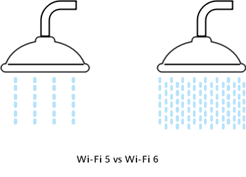

在802.11ac中，协议只规定了下行的MU-MIMO。上行还是单个节点独立传输的，而在802.11ax中，上下行都需要支持MU-MIMO。

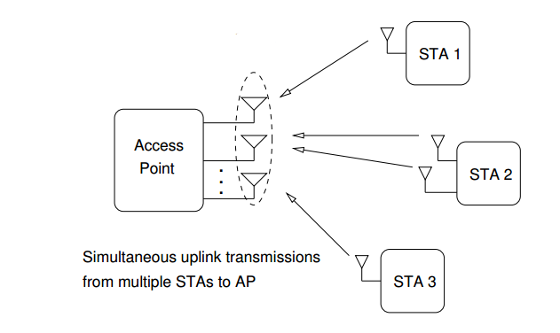

  ② **引入OFDMA技术**。802.11ax设计中参考了LTE中OFDMA的使用，可以让多个用户通过不同子载波资源同时接入信道，提高信道的利用率。不过因为802.11是一个分布式接入的场景，所以802.11ax中的OFDMA实际是比LTE中复杂度要低一些。

至于其中一些具体的介绍和一些其他的特性，建议参考NI的文章：[Introduction to 802.11ax High-Efficiency Wireless](https://www.ni.com/zh-cn/innovations/white-papers/16/introduction-to-802-11ax-high-efficiency-wireless.html)。

### 更好的节能性

用以增加移动设备的续航能力

随着IoT设备广泛应用，除了提升终端速率外，Wi-Fi 6更是关注了终端的耗电情况。

Wi-Fi 6采用TWT技术，按需唤醒终端Wi-Fi，加上20MHz-Only技术，使得终端的功耗降低**30%**。

### 降低时延

在低时延场景，例如VR/AR-互动操作模拟、全景直播、互动式游戏、沉浸式会议、高清无线投屏等，Wi-Fi 5的30ms时延已经无法满足需求，而Wi-Fi因为引入了OFDMA和空间复用技术BSS Coloring，令时延降低至**20ms**。

# BSS color

## 序言

参考资料：

- [What Is BSS Coloring In 802.11ax?](https://www.extremenetworks.com/extreme-networks-blog/)
- [What is BSS Color in 802.11ax?](https://www.extremenetworks.com/extreme-networks-blog/what-is-bss-color-in-802-11ax/)
- [How Does BSS Coloring Work in 802.11ax?](https://www.extremenetworks.com/extreme-networks-blog/how-does-bss-coloring-work-in-802-11ax/)
- [802.11-2016.pdf](/books/802.11™-2016.pdf)
- [Draft P802.11ax_D8.0.pdf](/books/Draft_P802.11ax_D8.0.pdf)

## 介绍

BSS Coloring是最初在802.11ah中引入的一种机制，用于为每个BSS分配不同的“颜色”。该技术目的是增加在密集环境中，无线网络的系统容量，增加BSS之间的频率重用。然而，当前的802.11的MAC层机制，其会导致一个BSS的设备会被同频道的另一个BSS影响，无法同时进行传输，从而对于网络容量没有提升。

在802.11ax中，BSS Coloring是一种用于解决由于重叠基本服务集（OBSS）提升空间重用率的方法，减少因为重叠BSS导致的MAC层竞争开销。BSS Coloring的目标是提升空间复用，同时不会因为BSS间的干扰而导致节点间PHY层传输速率的降低（即降低MCS值）。802.11ax设备通过向PHY头部添加字段（即BSS Coloring字段）来区分BSS，节点在竞争时，根据检测到物理层头部的BSS Coloring字段来分配MAC层的竞争行为。若BSS Coloring字段信息相同，那么代表在同一个BSS内(intra-BSS)。若BSS Coloring字段信息不同，那么代表这里是重叠覆盖区域，在多个BSS间(inter-BSS)。 在传统802.11中，若在BSS间(inter-BSS)，当节点检测到信道忙时，需要推迟自己的传输，直到信道空闲才可以发送。在802.11ax中，引入了**自适应CCA机制**(adaptive CCA)。通过提高BSS间(inter-BSS)信号检测阈值，同时保持BSS内(intra-BSS)的较低信号检测阈值（两个阈值，大约4dB左右的差值），来减少MAC层竞争时的竞争问题，提升MAC层效率。

BSS Color特性如下：

- STA可以使用信道接入规则（26.10 Spatial reuse operation）
- 降低能量消耗
- 更新NAV

## 什么是802.11ax中的BSS Coloring技术？

整理自[What is BSS Color in 802.11ax?](https://www.extremenetworks.com/extreme-networks-blog/what-is-bss-color-in-802-11ax/)

802.11协议是采用CSMA/CA作为MAC层的协议，其采用的是半双工通信机制，这表示在同一个时间只有一个无线电设备可以在网络上进行传输。如果一个802.11终端检测到任意一个802.11终端的传输信号(即PHY层的Header)，其会推迟传输。我们称多个AP和客户端在同一个信道上进行部署，并执行竞争传输叫做OBSS(具有重叠的基本服务集)。在OBSS中，我们描述这种同信道的干扰为co-channel interference(CCI).

信道复用的核心问题是最小化空口传输时间并减少由于OBSS场景导致的性能下降。 802.11ax修正案基于提升空间复用的思想，提出**自适应的CCA机制**(adaptive clear channel assessment, adaptive-CCA)来对于信道进行检测。

BSS Coloring，是用于识别重叠基本服务集（OBSS）的方法。 其最先是在802.11ah-2016修正案中定义，现在也沿用到了802.11ax中。 BSS Coloring是一个字段，标识了BSS的ID。当多个无线终端在同一信道上传输时，802.11ax无线电能够使用BSS Coloring字段区分BSS。

BSS Coloring的信息是同时被添加在PHY层和MAC层中的。在802.11ax PHY头部的Preamble中，其SIG-A字段包含6个Bit的BSS Coloring信息字段，如下表所示，该字段可以识别多达63个BSS。

| bit0   | 1           | 2     | 3-6    | 7    | 8-13      | 14       | 15-18         | B19-B20   | ...  |
| ------ | ----------- | ----- | ------ | ---- | --------- | -------- | ------------- | --------- | ---- |
| Format | Beam change | UL/DL | HE-MCS | DCM  | BSS Color | Reserved | Spatial Reuse | Bandwidth | ...  |

在802.11管理帧中也可以看到BSS Coloring信息(如上图所示)。在Beacon帧中的HE Element中，包含BSS Coloring的子字段。其也是6个Bit的BSS Coloring信息字段，可以标识63个BSS。

在802.11ax中，MAC层的竞争取决于检测到的BSS Coloring。其将CCA的阈值和BSS Coloring信息关联起来(即adaptive-CCA)，从而提升空间复用能力。让节点可以忽略OBSS间的传输，可以在此时同时进行传输，从而提升信道利用率。802.11ax修正案定义了两种的空间重用模式，一种称为基于OBSS PD的空间重用，另一种称为基于SRP的空间重用。

## BSS Color原理

整理自[How Does BSS Coloring Work in 802.11ax?](https://www.extremenetworks.com/extreme-networks-blog/how-does-bss-coloring-work-in-802-11ax/)

基本服务集（BSS）是任意802.11网络的基础拓扑。构成BSS的元素包含，包括1个AP和多个节点。在多个节点在信道传输时，802.11ax通过BSS Coloring字段来区分BSS。若BSS Coloring信息相同，那么是BSS内的传输，若BSS Coloring不同，那么是BSS间的传输，即来自于OBSS内部的传输。

对于802.11ax的AP，其如果检测到使用相同颜色的OBSS，则它能够更改变其BSS颜色，减少同频干扰。若AP与AP间的BSS Coloring一样，那么这也是一种BSS Coloring的冲突，即颜色冲突。如上图所示，如果802.11ax AP听到来自其他AP或者该AP节点的不同BSS Coloring字段，那么是检测到一次颜色冲突。

另外，如果终端检测到颜色冲突，则该终端会向其关联的AP发送颜色冲突报告。如上图所示，AP-1无法听到AP-2，但AP-1的关联的终端可以听到来自于OBSS区域内，其他不同BSS Coloring的传输，从而向AP发送颜色冲突报告。终端向AP会报告其能够监听到的所有OBSS的BSS Coloring信息。

当AP检测到颜色冲突后，其可以决定改变其BSS颜色。不过改变BSS Coloring的标准和选择新BSS Coloring信息的方法超出802.11ax草案修正案的范围。WLAN供应商目前可以自行制定，例如Aerohive信道选择协议（ACSP）。

AP会通过Beacon告知所有关联在本BSS内部的节点，BSS Coloring的改变。BSS Coloring的改变还可以通过探测响应和重新关联响应帧中进行通知。如上图所示，AP告知节点BSS Coloring的颜色变化，其New BSS Color子字段则包含新BSS Coloring的数值。

## 初始化BSS color

当HE AP开始一个基础BSS（infrastructure BSS）或者HE STA开始一个IBSS或者MBSS，在它发送的第一个**HE Operation element**中，其帧格式如下图所示，设置BSS Color子字段为1~63中的一个值，并且在BSS的存在时间或直到BSS color改变，都需要维持这个值不变。如果选择一个BSS Color，HE STA需要考虑相邻OBSS中BSS color的使用。

其中**BSS Color Information**字段如下所示

**Partial BSS Color**字段为1表示将基于(AID 分配)中定义的BSS颜色的AID分配规则应用于BSS

AID分配规则：

## 禁用BSS color

当HE STA探测到BSS color collision时，发送一个HE Operation element来禁止BSS使用BSS color，设置HE Operation element中的BSS Color Disabled子字段为1来通知该BSS下的其他STA禁止使用BSS Color；否则HE STA设置BSS Color Disabled子字段为0。

> NOTE: 发送了HE Operation element的HE STA不要长时间禁止BSS color，否则会影响其他依赖BSS color的HE STAs的功能。

如果AP接收到的HE operation element中的BSS Color Disabled子字段为1，则：

- non-AP HE STA使用HE PPDU中的Address 1, Address 2, Duration/ID代替RXVECTOR parameters BSS_COLOR和TXOP_DURATION来决定STA是否更新intra-BSS NAV
- non-AP HE STA使用HE PPDU中的Address 1, Address 2代替RXVECTOR parameters BSS_COLOR和STA_ID来决定STA在PPDU持续时间是否进入休眠

## BSS color冲突

BSS冲突上报使用的是管理帧，这里先复习一下管理帧的具体细节。

| 字段   | Frame Control | Duration | Address1 | Address2 | Address3 | Sequence Control | HT Control | Frame Body | FCS  |
| :------------ | -------- | -------- | -------- | -------- | ---------------- | ---------- | ---------- | ---- | ---- |
| Octets     | 2             | 2        | 6        | 6        | 6        | 2                | 0 or 4     | Variable   | 4    |

管理帧：Beacon、ATIM、Disassociation、Association Request、Association Response、Reassociation Request、Reassociation Response、Probe Request、Probe Response、Authentication、Deauthentication、Action、Action No Ack、Timing Advertisement。

其中Action frame的frame body格式如下所示。

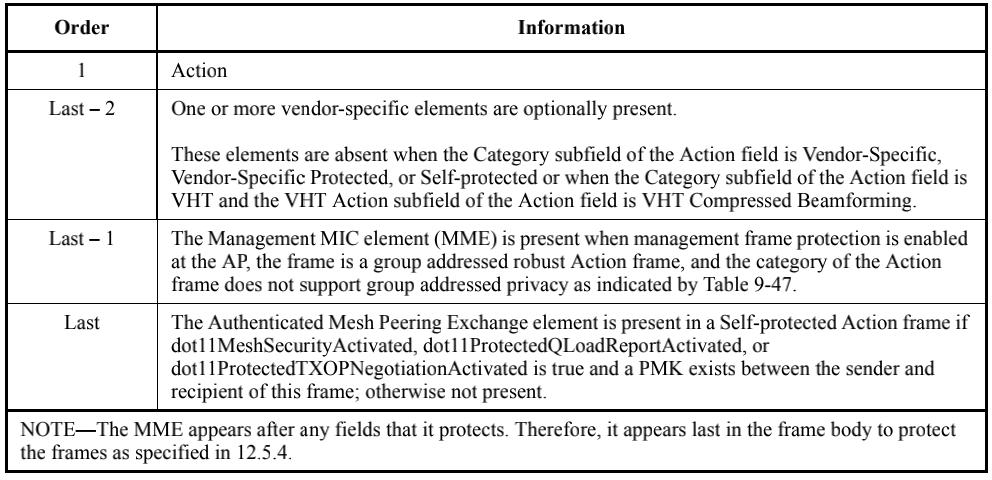

Action字段格式如下

Action frame的类别如下图所示：Spectrum management Action、QoS Action、DLS Action、Block Ack Action、Vendor-specific action、Radio Measurement action、Public Action、FT Action、SA Query Action、Protected Dual of Public Action、HT Action、TDLS Action、WNM Action、Unprotected WNM Action等。

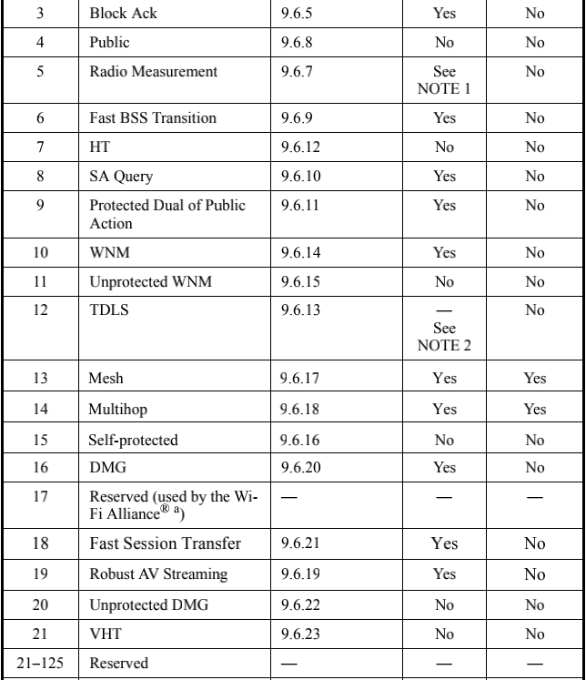

这里讨论的BSS color冲突上报就隶属于WNM Action类别中的Event Report Frame中，Action字段格式如下。

Category（类别）：值为10，代表WNM Action

WNM Action：其他值省略，这里为上报，所以为1

| WNM Action field value | **Description** |
| ---------------------- | --------------- |
| 0                      | Event Request   |
| 1                      | Event Report    |
| 2-255                  | 此处省略        |

**Dialog Token**判断是上报还是响应帧

| Dialog Token value | Description             |
| ------------------ | ----------------------- |
| 0                  | 该帧为事件报告帧        |
| 非零               | 对应Event Request frame |

**Event Report Elements**格式如下图所示，注意，由于对应的是BSS Color事件，则**Event Report Status**为0(Successful)，并且**Event Type**是4（BSS Color collision）或者5（BSS Color in use）,则在事件上报状态后面的字段使用Event TSF, UTC Offset, Event Time Error, Event Report等字段。

Element格式如下如所示，对于BSS Color事件，其中Element ID Extension长度为1个字节。

其中**Element ID**定义如下表所示。

| Element                       | Element id | **Element ID** Extension | Extensible | Fragmentable |
| ----------------------------- | ---------- | ------------------------ | ---------- | ------------ |
| BSS Color Change Announcement | 255        | 42                       | YES        | NO           |

**Event Token**事件令牌：由于BSS Color冲突事件是自动上报的，所以该字段为0

**Event Type**事件上报类型：定义如下表所示

| Event Type | Name                    |
| ---------- | ----------------------- |
| 0          | Transition              |
| 1          | RSNA                    |
| 2          | Peer-to-peer link       |
| 3          | WNM log                 |
| **4**      | **BSS Color Collision** |
| **5**      | **BSS Color In Use**    |
| 6-220      | Reserved                |
| 221        | Vendor Specific         |
| 222-255    | Reserved                |

**Event Report Status**定义如下图所示

**Event TSF**:当STA记录事件时，该字段为TSF的值。

**UTC Offset**：当TSF timer等于0时，该字段是与UTC事件相对应的UTC值。如果UTC Offset未知，则改字段为0。

**Event Time Error**：UTC标准偏差，对应事件记录的TSF值。如果Event Time Error未知，则该字段为0.

**Event Report**：该字段包含单个事件报告的说明。相对于BSS color collision event report，该字段是一个八字节共64位，每一位对应BSS Color(1-63)，如果该bit的值为1，则表示non-AP HE STA检测到与该位置对应的BSS Color已被使用，我理解的是第0位保留不用。举例：如果第10bit位为1，则表示non-AP HE STA检测到BSS Color=10已经被OBSS使用。

## BSS color change发布

当监测到bss color collision，禁用BSS color后，HE AP使用**BSS Color Change Announcement element**来宣布即将到来的BSS color改变。

> - non-AP HE STA不应该发送BSS Color Change Announcement element。
> - Beacon, Probe Response, (Re)Association Response和HE BSS Color Change Announcement帧可以携带BSS Color Change Announcement element，AP通过发送这些帧来宣布bss color change。
> - HE AP公告即将到来的BSS color change的时间要足够长，这样BSS内的所有STA，包括处于PS模式下的，可以确保在BSS Color改变之前收到携带BSS Color change Announcement element的帧。

如果使用Action frame来通知颜色改变，帧细节在上一节已经讨论过。

> 注意：HE AP可能会将HE BSS color change announcement frame作为action frame来发送给一些错过了颜色更改公告并仍以旧颜色发送的STA.

在802.11ax中新增两个类别，category字段新增的值如下所示

BSS Color change announcement frame对应于Protected HE Action frame，其帧格式如下所示。

其中category就是新增的值：31

则Protected HE Action字段值如下所示，对应value=0，为颜色更改公告。

**BSS Color Change Announcement element**格式如下所示

其中New BSS Color Information字段如下

- 如果BSS Color Change Announcement element中的Color Switch Countdown字段的值大于1，那么下一个TBTT后，AP应该将Color Switch Countdown减1。当Color Switch Countdown等于1时，就是BSS color change TBTT，也就意味着**在该时刻修改BSS color**。当HE AP公示BSS Color即将改变后，不应该修改BSS Color change TBTT。
- 属于共同托管的BSSID集的AP（请参见26.17.7（共同托管的BSSID集））应选择“ Color Switch Countdown”字段的值，以使集合中各个BSS之间的BSS颜色变化TBTT间隔不大于该集合中具有最大信标间隔的BSS的信标间隔。

在导致BSS color change TBTT内，也就是Color Switch Countdown的值大于1的时间段内：

- HE AP应该设置BSS Color Disabled子字段为1，同时，继续通过HE Operation element中的BSS Color子字段发布之前存在的BSS color。
- HE AP不能改变BSS Color Change Announcement elemen中New BSS Color子字段的值。
- HE AP应该设置HE PPDU中的TXVECTOR parameter BSS_COLOR为之前存在的BSS color。

在BSS color change TBTT内，也就是Color Switch Countdown的值等于1的时间段内：

- HE AP应该将它发送的HE Operation element中的BSS Color Disabled子字段置为0，除非HE AP属于co-hosted BSSID set（共同托管的BSSID集），这样它可以继续保持该值为1，直到co-hosted BSSID set中所有的BSS都结束了各自的BSS color change TBTT。
- HE AP在HE operation element中的BSS Color子字段中使用新的BSS color。
- HE AP在TBTT之后在它发送的所有帧中使用新的BSS color。

# SRP空间复用和Adaptive-CCA

## 序言

BSS Coloring技术是802.11ax中引入，目的进一步优化空间复用（Spatial Reuse Parameter）。在前文讨论过关于BSS Coloring技术，但是关于如何基于BSS Coloring进行Spatial Reuse Parameter，还需要额外介绍Adaptive-CCA机制。本文就关于这两个问题做一个阐述。

本文参考自：

- [Future Indoor Networks: The role of Wi-Fi and its evolution - nokia bell lab](/books/Future-and-Indoor-Networks.pdf)
- [IEEE 802.11ax: Highly Efficient WLANs for Intelligent Information Infrastructure](/books/IEEE-802.11ax-Highly-Efficient-WLANs-for-Intelligent-Information-Infrastructure.pdf)
- [Introduction to 802.11ax High-Efficiency Wireless](https://www.ni.com/zh-cn/innovations/white-papers/16/introduction-to-802-11ax-high-efficiency-wireless.html)
- [Draft P802.11ax_D8.0.pdf](/books/Draft_P802.11ax_D8.0.pdf)

## SRP空间复用（Spatial Reuse Parameter）

在802.11ax中，基于BSS Coloring，我们可以区分出Inter-BSS和Intra-BSS。如果现在一个Inter-BSS的节点检测到信道是忙的，但是其知道这个信道不是自己BSS正在进行传输，那么其可以认为信道是idle状态，进而继续backoff。如果backoff到0，那么其可以进行传输。

如上图所示，假设一个BSS的AP发送了一个SR-enable trigger frame（协议中称为SRP PPDU），代表当前的AP是允许一个SRP传输的。目前我理解的SRP仅仅支持AP上行接收的情况。AP发送完SRP TF帧后，其执行自己BSS内的一次传输，比如说一次上行传输。此时，如果一个支持SRP技术的Inter-BSS STA，也就是其他BSS Color下的节点，收到该SRP TF帧后。其会采用adaptive-CCA机制进行信道检测。如果其在adaptive-CCA的阈值下（即OBSS_PD阈值）检测信道是idle的，那么其可以继续执行backoff的操作。当backoff到0以后，其就可以执行一次数据的传输。

SR-enable的标志位应该是在PHY头部的HE-SIG-A1里面的Spatial Reuse field，这里面一共有4个field，可以设置disable SRP技术，也可以设置对应延迟或者具体的adaptive-CCA阈值等。

另外需要注意的是，这里允许传输的inter-BSS STA的数据帧大小也是有限制的。在一开始AP发送的TF帧中，实际上是包含了duration参数设置，代表其上行接收PPDU过程所需要的时间。inter-BSS需要在该Duration时间内完成SRP空间复用的传输，这里可能又会应用到动态帧分片技术了。

SRP技术实际上是一种利用捕获效应的空间复用技术，简单理解就是，如果当前AP的接收信号质量不错，不容易被干扰。那么此时就允许在该网络内，一个其他BSS的节点传输。由于本身我的信号强度够强，所以不会受到其他节点的干扰。该技术可以利用的核心机制就是adaptive-CCA机制，AP可以控制CCA的阈值，从而控制让部分节点（也就是不对自己产生干扰的节点）进行空间复用。

## Adaptive-CCA（自适应CCA）

**CCA技术是**802.11协议用来检测信道是否有数据包在传输的**物理载波监听技术**。

802.11ax除了传统的ED_Threshold和CS_Threshold，进一步引入了OBSS_PD这个参数。

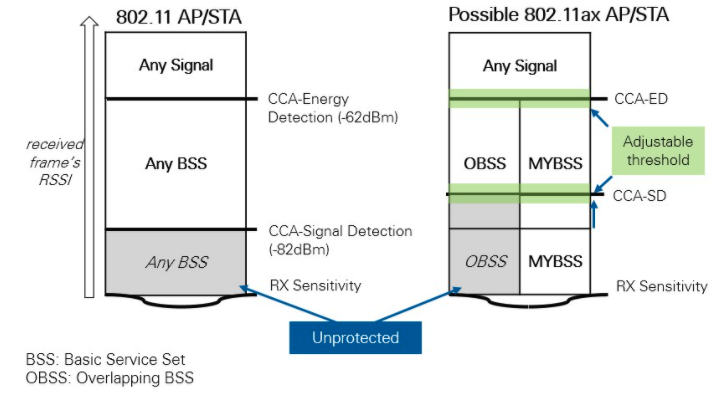

上面左图描述的是传统802.11的情况，其中CCA-Energy Detection对应到EDThreshold（-82 dBm），CCA-Signal Detection对应到CS_Threshold（-62 dBm）。右边描述的是802.11ax中的情况，我们可以看到起CCA_SD实际上一个新的阈值（协议命名是OBSS_PD），其高于原来的CS_Threshold（-62 dBm），这个阈值是自适应调节的，所以被称为Adaptive-CCA。该阈值的目的就是用来区分，目前CCA检测到的数据帧是不是本BSS域内的。按照SRP的规则，如果STA检测到该数据帧不是本BSS的，而且STA的信号强度是小于该Adaptive-CCA的，那么可以认为信道是idle，可以继续backoff。

我们用下图解释。*（注：由于参考了多份材料，其所用的概念命名有所区别。在下图中，CCA_SD对应的是-82dBm，也就是传统的CS_Threshold。而OBSS_SD对应的是Adaptive-CCA的阈值，也就是上图右的CCA-SD，协议的命名是OBSS_PD）*

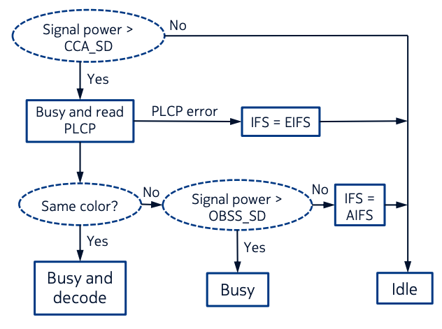

该图是描述一个inter-bss的STA如何做判断的。如上图，一开始STA会判断是否有数据帧在传输（也就是和CCA_SD比较）。如果大于，那么就意味着有数据在传输，那么说明信道忙，并且要开始接收数据，接收是从物理层头部PLCP开始的，这是一个独立的片段。

- 如果PLCP失败，那么等待EIFS时间（这里笔者不是很认同上图，如果PLCP解调失败，那么EIFS等待完的结果实际上是挂起到当前数据帧的传输结束，而不仅仅是等待EIFS时间，这点记录下）。

- 如果PLCP接收成功，那么判断该数据帧是不是同一个BSS的（在PLCP中会标识，该数据帧是哪一个BSS的，标识方法是BSS Coloring）。

- - 如果是相同的BSS，那么意味着该数据帧节点需要接收，所以反馈信道忙，并进入接收状态。

        - 如果是不同BSS，那么该节点需要与OBSS_SD的阈值比较，该阈值就是我们这里所说的Adaptive-CCA阈值（按协议应该是OBSS_PD阈值）。
        
        - - 如果信号强度大于OBSS_SD阈值，那么意味着inter-BSS的节点和当前接收上行传输的AP干扰比较大。如果该节点传输，会影响AP的上行接收，所以无法执行SRP传输。因此信道还是busy的状态，不能够backoff。
                - 如果信号强度小于OBSS_SD阈值，那么意味着inter-BSS的节点不会干扰到AP的上行，其检测结果为idle，从而该节点可以执行backoff（这里竞争是为了多个inter-BSS的STA，同时检测到信道是idle的，从而发生冲突）。当节点backoff到0以后，那么可以进行传输。

在协议中，该OBSS_SD（本文命名有点杂，对应协议是OBSS_PD）是一个范围值，是AP根据网络情况自适应调节的，并且在Spatial Reuse field给出。

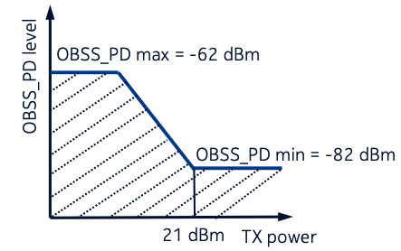

如上图所示，该范围是在-62dBm和-82dBm之间，也就是对应传统的ED_Threshold和CSThreshold之间。该图上的21dBm描述的参考的发送功率，TXPWR_Ref。

# OFDMA

## 序言

参考资料：

[What are OFDMA Resource Units in 802.11ax?](https://www.extremenetworks.com/extreme-networks-blog/)

[Wi-Fi_6_FD_Extreme_Networks_Special_Edition](/books/Wi-Fi_6_FD_Extreme_Networks_Special_Edition.pdf)

[Draft P802.11ax_D8.0.pdf](/books/Draft_P802.11ax_D8.0.pdf)第27.3.2节(Subcarrier and resource allocation)

[OFDM and OFDMA Subcarriers – What Are the Differences?](https://www.extremenetworks.com/extreme-networks-blog/ofdm-and-ofdma-subcarriers-what-are-the-differences/)

## 简介

无线和有线通信不同。有线通信中信息是承载在线缆上，通过高低电平来标识不同的信息010010。但是在无线通信中，信息的载体就变成了高频信号，这种将信息加载到某个高频信号进行传播的过程就叫做载波调制，而承载着信息的高频信号，我们也称之为载波。拿日常生活中的例子来说，Wi-Fi通信类似快递送货，载波就像是送货的小车，发送方通过载波调制将货物(信息)放到小车上再送达到接收方。

不过这些频段不仅Wi-Fi可以用，其他短距无线传输技术比如RFID、蓝牙等，也都可以使用，所以干扰也很多。

在Wi-Fi 4/5，载波调制用的是正交频分复用OFDM（Orthogonal Frequency Division Multiplexing）技术。

OFDMA技术是802.11ax引入了新的物层机制，其可以让多个用户并行进行接入。

由于引入了OFDMA技术，所以需要定义时频资源块（Resource Unit）的概念，这些时频资源块都是彼此正交的。802.11ax中的OFDMA实际上是借鉴LTE的，但是没有LTE资源块那么复杂（比如RE，RB，CP，REG，CCE这些），802.11ax中仅仅有RU（Resource unit）的概念，故本节主要叙述802.11中子载波分配，以及RU的设置。

以上图为例，左图是OFDM的工作模式，右图是OFDMA的工作模式。图中一共有4个节点，分别以4种颜色进行标识。图中横轴为时域，纵轴为频域（即对应不同的子载波）。

- **OFDM工作模式**（左图）：用户是通过不同时间区分出来的。每一个时间片段，一个用户完整占据全部的子载波，并且发送一个完整的数据包（如图中红色部分标出的WLAN Packet）。
- **OFDMA工作模式**（右图）：用户是根据时频资源块RU区分出来的。首先将整个信道的资源分成一个个小的固定大小的时频资源块，这个时频资源块也就是RU（Resource unit）。在该模式下，用户的数据是承载在每一个RU上的，故从总的时频资源上来看，每一个时间片上，有可能有多个用户同时发送。

OFDMA相比OFDM一般有两点好处：

- **资源的更细腻分配**。特别是在部分节点信道状态不太好的情况下，可以根据注水定理的思想（即根据信道质量分配发送功率），来更细腻化的分配信道时频资源
- **能够更好的提供QOS**。因为初始的802.11是占据整个信道的，如果有一个QOS数据包需要发送，其一定要等之前的发送者释放完整个信道才行，所以会存在较长的延迟。在OFDMA的情况下，由于一个发送者只占据部分信道，所以能够减少QOS节点接入的延迟。

拿小车来举例，OFDMA相当于在小车中划出专门的隔间，通过调度每个隔间放置不同用户的货物，这样一次可以为多个接收方送货。

## 子载波

在传统的802.11a/g/n/ac中，采用了正交频分复用（OFDM，Orthogonal Frequency Division Multiplexing）作为单用户传输的物理层技术。

在802.11ax中，引入了一种新型的基于OFDM的OFDMA技术，其是OFDMA对应的多用户版本，其将信道划分成更小的时频资源单元，即RU（Resource Unit）。

通过OFMDA的划分，多个用户可以并行进行传输，提高信道利用率。

每一个RU内的数据和导频，在OFDMA子信道内都是相邻而且连续的。

OFDM和OFDMA技术的实现是通过快速傅里叶变换（FFT）和快速傅里叶逆变换（IFFT）来构成的。

在OFDM中，信道被分成了多个子载波，每一个子载波是正交的，不会互相干扰，所以其子载波之间是没有保护间隔的。

在OFDM中，也会分配一个子载波作为Null子载波，其不承载任何数据，用来防止载波间干扰（Inter-Carrier Interference ，ICI）。

OFDM和OFDMA都通过一个数学函数（快速傅里叶逆变换）IFFT将信道划分为子载波。

如下图所示，802.11n/ac 20MHZ信道带宽包含64个子载波。其中52个子载波用于承载调制数据（data subcarriers），4个用于导频载波（pilot subcarriers），8个作为保护频带（grard bands）。每个OFDM子载波间隔为312.5KHZ，也就是3.2us。OFDM子载波可以称为OFDM subcarriers或者OFDM tones。

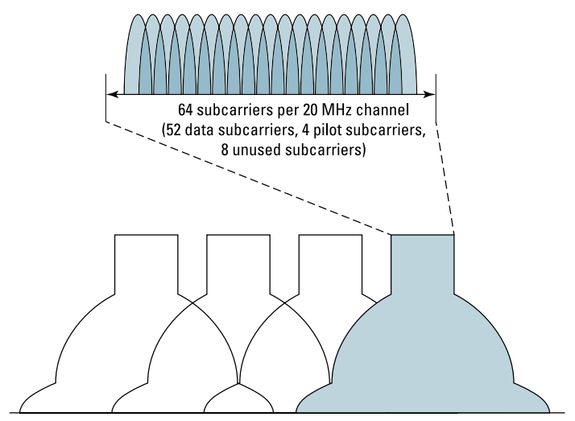

在802.11ax中，相同的信道带宽采用的FFT的点数增加4倍。比如原来20M信道采用64点的FFT（即64个子载波），现在就变成了256点的FFT（即256个子载波）。

OFDMA子载波间隔为78.125KHZ，也就是12.8us。因此如下图所示，由于存在78.125KHZ的间隔，OFDMA 20MHZ通道总共包含256个子载波（tone）。

> 更窄的子载波间隔，允许会提供更高的频域分辨率，提升均衡能力，并且增强信道鲁棒性

类似于OFDM一样，OFDMA存在三种类型的子载波：

- **数据子载波**（Data subcarriers）：这些子载波用于承载数据，其传输速率是在802.11ac的基础上（即在802.11ac的MCS上），引入了两个新的MCS（Modulation and Coding Schemes），包含1024-QAM这种更高的调制阶数。
- **导频子载波**（Pilot subcarriers）：这些子载波用于发射器和接收器之间的同步，并且不携带任何调制数据。
- **未使用的子载波**（Unused subcarriers）：剩余未使用的载波主要用于保护子载波（gard carriers）或者空子载波（null carriers），以抵抗来自相邻信道或相邻子信道的干扰（即抵抗ICI）。

利用OFDMA，这些子载波组合在一起成为分区子信道，也成为资源单元（RU）。通过将信道进行进一步的细分，发送到多个用户的比较小帧可以同时传输。在OFDMA信道内，每个资源单元内的数据和导频子载波既相邻又连续。

>为了兼容早期的其他802.11协议，802.11ax仍将支持OFDM。在802.11ax中，管理帧和控制帧仍将使用802.11a/g/n/ac的OFDM技术，以及以基本的传输速率进行传输（一般就是最低传输速率），这保证了其他早期的802.11终端能够互相理解。此时管理帧和控制帧都是采用整个20MHz信道，利用整个64个子载波进行传输。OFDMA技术仅仅用于802.11ax AP和802.11ax终端之间的数据帧交互。

在802.11ax中，20M信道一共有256个子载波，而实际资源块RU总共只使用了234个，两者相差了22个子载波。这些子载波是用来做保护间隔的：包含了DC，Null Sub-carriers以及Guard Sub-carriers，如下图：

图中分别列举了RU为26,52,106个子载波的情况，我们具体解释如下：

- **DC保护**：以**中心子载波**为核心，一共有7个子载波作为DC保护的，即DC的保护带宽一共是7*78.125kHz=546.875kHz，与原来的一个DC保护（即312.5kHz）是比较接近的。

- **Guard Sub-carriers**：保护子载波这里指的是**信道之间的保护子载波**了（比如20MHz信道之间的保护），如上图所示，其选取了左边的6个子载波以及右边的5个子载波作为保护，这点设计是和802.11a的载波设计是一样的，只是子载波的带宽不一样而已。

- **Null Sub-carriers**：在一些早期的书里面，比如《MIMO-OFDM Wireless Communications with MATLAB》，其中是将Guard Sub-carriers和Null Sub-carriers等价看待的。不过在802.11ax中，Null子载波是指的**RU之间的保护间隔**，一般是1个子载波。

下面这张彩图可能更清晰一些：

以RU为26所示，这里一共损耗了6+1+1+7+1+1+5=22个子载波。

最后介绍一下在802.11ax中，导频子载波（Pilot）的设计。

- 导频子载波是用来做信道估计的，利用估计出的信道系数完成解调的工作。

- 由于802.11ax还是一个分布式接入的工作，所以**Pilot是包含在每一个RU内部的**。

- 在802.11中，始终是用特定的子载波作为导频子载波，从而完成信道估计的功能，在802.11ax中，导频子载波的分配如下：

其中红色的直线即代表导频子载波的位置，代表的是子载波序号，其导频资源是均匀分布在整个信道上的。

如上图所示带宽为20MHZ，RU为26时，-116号子载波为导频子载波，102号子载波为导频子载波。也就是每个RU的第6个子载波为导频子载波，倒数第七个为导频子载波。

在RU为26个子载波的情况下，每一个RU中都包含了2个pilot，在RU为52个子载波的情况下，每一个RU包含4个pilot。通过这些pilot的设置，在传输过程中，接收方才可以有效地估计信道，并完成解调的工作。

## OFDMA资源块RU（Resource unit）

在802.11ax中，一个最小的时频单位为RU。与LTE中的RE（Resource Element）和RB（Resource Block）不同，LTE中的RE和RB都是一个固定值。

在802.11ax中RU是一个相对的概念，即存在很多种不同大小的RU，如下图所示：

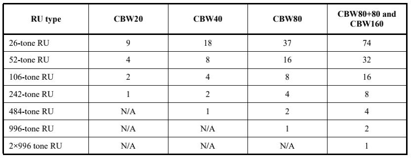

图中，一共定义了6中RU类型，分别是26，52，106，242，484以及996个子载波。

正交频分多址（Orthogonal Frequency-Division Multiple Access*，*OFDMA）作为主要的802.11ax增强功能，其是OFDM数字调制技术的多用户版本。 OFDMA将信道细分为较小的资源单元RU。通过OFDMA的资源细分，多个客户端可以通过占据不同的RU资源进行并行传输。

一个20MHz的OFDMA信道包含了256个子载波（Subcarriers，或者称为Tones）组成。这些子载波组成了一些子信道，我们称一个子信道为一个资源单元（RU）。如上图所示，当20MHz信道时被细分时，802.11ax终端可以使用4种不同大小的RU单元，分别包含26个子载波，52个子载波，106个子载波和242子载波，大约相当于2MHz，4MHz，8MHz和20MHz信道带宽的分别。802.11ax的AP决定了在一个20MHz信道内可以使用多少个RU，以及RU形成的不同组合。

> 本人理解的是存在不同类似RU共存的情况，比如在20M带宽情况下，2个52-subcarrier RU和1个106-subcarrier RU是可以共存的。这样设计的好处在于可以更有效的分配频率资源，比如在20M的信道条件下，一共可以存在9个26-subcarrier的RU，故需要9个人竞争才可以占据全部信道，否则就会有资源浪费（在802.11ax中，每一个发送者每次只能够竞争一个信道）。所以在发送者数量不足的情况下，只有通过不均等的分配，才可以更加有效的利用信道资源。

802.11ax AP可以将整个信道分配给一个客户端，也可以利用OFDMA技术将信道分给多个终端同时接入。

例如，802.11ax AP可以使用8 MHz的带宽与一个802.11ax终端通信，同时使用4 MHz的带宽与另外三个802.11ax终端通信。

这些通信过程可以是下行链路，也可以是上行链路。

在上图示例中，802.11ax AP首先向Client 1和Client 2发送下行数据。

在第一时刻，20MHz的信道通过OFDMA技术被划分成了两个子信道。在OFDMA技术中，20MHz信道包含了256个子载波，Client 1和Client 2分别占据106个子载波，这些子载波互相没有交叠。

在第二时刻，802.11ax AP向Client 3，Client 4，Client 5和Client 6发送下行信息。在此时，信道被划分成4个子信道，分别占据52个子载波。

在第三时刻，802.11ax AP使用整个信道发送下行数据帧给Client 5，此时一共使用了242个数据子载波，其可以有效的利用整个20MHz的信道。

在第四时刻，AP使用两个子信道，分别是106个子载波向Client 4和Client 6发送数据。

在第五时刻，AP在此向单个终端（即Client 1）发送下行数据，其占据整个20MHz信道，包含242个数据子载波。

在第六时刻，AP同时向Client 3，Client 4和Client 6发送下行数据。此时，信道被划分成3个不等大小的子信道，其中Client 3和Client 4分别占据52个子载波，Client 6占据106个子载波。

# MAC层接入机制

## 序言

在802.11ax以前，MAC的接入机制是典型的CSMA机制（即DCF中所采用的CSMA/CA）。

在引入了OFDMA的需求之后，802.11ax的MAC层随机接入机制也发生了变化，在协议中，代替传统的CSMA思想，802.11ax采用了基于ALOHA思想设计了竞争协议。其基本思想已经从强调分布式的场景，逐渐变成了强调中心式，高密度，优化资源分配上了。

本节主要就是介绍802.11ax中所采用的TF（Trigger Frame）以及TF-R（Trigger Frame for Random access）机制。

参考资料：

- [Wi-Fi_6_FD_Extreme_Networks_Special_Edition](/books/Wi-Fi_6_FD_Extreme_Networks_Special_Edition.pdf)

## MAC层接入机制

802.11ax提升效率的秘诀之一就是OFDMA技术。OFDMA是OFDM技术的多用户版本，在诸如LTE等的其他无线技术中已经被广泛采用。在OFDMA中，信道被细分称更小的单元，称为资源单元（Resource Units，RU） 。通过细分信道，OFDMA通过分配不同的RU给多终端，从而允许多个终端执行并行传输，同时接入无线网络。即总结而言，OFDMA是一种多用户传输技术。

如上图所示，在802.11ax中，1个802.11ax AP将1个20 MHz信道划分为多个资源单元（RU），每一个RU被分配给不同的终端，802.11ax AP同时向这些终端进行下行传输。

同时，802.11ax AP还可以同步调度802.11终端，让其执行并行的上行传输。

在802.11ax中，竞争的规则还是存在的（即CSMA/CA）的规则，任何节点（包括AP）在发送之前都需要竞争。

在此技术上，AP通过利用竞争（比如利用更高优先级的竞争参数）获得信道后，通过TXOP（transmission opportunity ）技术占据信道一段时间，从而达到控制信道接入的目的，因此802.11ax中AP具有一定的控制能力。

一旦AP竞争并获得了TXOP是时间，AP可以控制高达9个802.11ax的终端进行上行传输或者下行传输（指的是在20MHz信道带宽下，最多可以承载9个RU，每一个RU为26个子载波）。

针对于不同的TXOP，其RU的数量也是不一样的。对于上行接入（UL-OFDMA），AP采用触发帧机制（Trigger Frames），向802.11ax的终端进行调度和RU资源的分配。

在802.11ax中，还存在一个OMI机制，这个机制是为了解决802.11终端是采用竞争接入信道（即单用户接入）还是采用OFDMA调度接入信道的（即多用户接入）。在OMI中，终端可以向AP发送信息，通知AP其支持的上下行所支持的最大空间流数目以及信道带宽。如上图所示，802.11ax终端采用OM控制字段（在数据帧或者管理帧中），来指示传输模式或者接收模式的变化。比如802.11ax终端可以在单用户接入或者多用户接入模式间切换。

## TF机制（Trigger Frame）

802.11ax与传统的DCF所需求的MAC层机制是不同的。传统的DCF同一个时刻只有一个用户接入信道，而由于802.11ax采用OFDMA技术，其需求多个用户可以同一时间接入信道（选择的RU是正交的）。

本节所介绍的TF机制，主要是用在UL MU（Uplink Multi-users）这种上行传输的场景下的。

TF机制是一个**上行传输**的框架，其具体的随机接入的方法是TF-R机制。

TF是一种上行接入的传输框架，其定义了一个很简单的过程：

- AP发送Trigger frame，宣称这一轮接入开始。Trigger frame中，包含了节点上传所使用的时频资源（RU）信息。
- 根据Trigger frame中的指示，节点选择其对应的RU位置，进行OFDMA的接入。多个节点同时向AP发送上行PPDU。
- AP接收完全部数据后，反馈ACK，结束这一轮传输。

TF帧不仅仅指定了什么节点发，还指定了节点的发送一系列参数，如下图：

其中第一列是该RU被分配给那个用户（具体是指定用户的AID），如果AID设置为RA（协议中RA的AID号还没给定，即TBD），那么该RU就是供节点竞争的。后面的几列包含了比如Coding Type以及MCS值，这一块细节较多，暂时不展开。

以上就是一个TF的接入框架，对比传统的802.11有以下不同：

- **单节点接入和多节点接入：**传统的802.11中，都是单个节点占据整个信道的。在TF中，多个节点基于OFDMA，同时接入信道。
- **发起者不同**：在传统的802.11中，节点只要竞争到信道，就可以立刻发起传输。而在TF中，只有当AP发送了TF帧之后，节点才可以发起上行接入竞争。
- **ACK反馈时机不同**：在传统802.11中，ACK是在发送完之后，立刻被反馈的。而在TF中，ACK实际上是等所有用户都传输完之后，再一次反馈给所有接受者的。由于每一个发送者可能发送的数据包长短不一，所以先发送完的，需要等待后发送完的。这一点实际上也是多用户接入协议一个设计的公共问题。
- **使用场景不同**：基于以上的几点不同，我们还可以理解，TF机制本身就是在假定网络是工作在基础架构的情况下，进行的设计，其不好在IBSS网络情况下工作。而传统802.11中的DCF设计，是既可以在基础架构模式下，也可以在IBSS模式下工作的。

> 注：802.11ax中不是完全把DCF删除，而是分时采用不同的模式。TF机制主要是用在上行接入这一部分的。

## TF-R机制（Trigger Frame for Random access）

TF-R是基于TF的进一步扩展，是在TF机制中，引入了竞争的机制，其基本思想是Slot-Aloha。

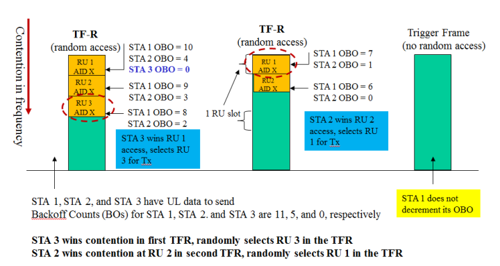

TF-R是将原来时域竞争转为频域竞争（如左边红色竖线上所示）。

TF-R是在前面所述的TF过程之前执行的，在每一次接入时，AP首先发送TF-R帧，在该帧中的部分RU其相应AID=X，这个X代表这个RU是供节点竞争接入的。节点在识别到TF-R帧之后，具体是采用OBO（UL-OFDMA Backoff）的机制竞争（TF-R的接入思想是基于Aloha而不是CSMA的主要原因也在这里）。

> 注：Aloha和CSMA的核心区别在于LBT（Listen Before Talk）机制上：Aloha是没有LBT的，而CSMA是基于LBT的。

在OBO中，每一个节点首先从CWO（Contention Window for UL-OFDMA）窗口中，选择一个随机数并放入Backoff counter中。

如上图，STA1选择的是10，STA2选择的是4，STA3选择的是0。

然后节点比较，这一轮TF-R帧中，可供竞争的RU slot的数目，比如上图RU数目为3。若Backoff counter小于RU的总数（比如STA3选择为0，其小于3），那么节点就可以发送数据，反之不行。那么该节点就随机选择一个RU（比如上图，从3个中随机选择1个，即RU=3），然后在该RU上进行数据传输。

当RU=3被竞争之后，开始下一个的TF-R。此时节点首先要进行Backoff过程，即本地的Backoff counter要减去上一轮总的竞争RU数目（比如STA2选择为4，那么要减去3，即将Backoff counter设置为1）。若新的一轮中节点的Backoff counter小于这一轮的可供竞争的RU数目（比如STA2现在Backoff counter为1，RU数目为2），那么该节点竞争胜利，可以任意选择一个RU（比如选择RU=1）。

只有当TF帧中，有被用来Random Access的RU的时候（即TF-R帧），其才会触发OBO的过程，若该TF帧中没有这种RU，那么不会进行Backoff。

当RU资源被竞争好以后，AP发送TF帧，节点正式向AP反馈上行数据，其过程就和我们之前所述的TF过程一样了。

> 注：Slot-Aloha的思想是用来判断节点在这个时刻可不可以发送，并没有包含在哪个位置具体传输的机制。故OBO主要是用来判断，节点能不能发的，至于使用哪个信道具体发送，那么这里是随机的。这一块可能有性能评估的问题，不过目前协议是这样设定的。

## TF帧

当进行上行（UL-OFDMA）或者下行（DL-OFDMA）传输时，都需要触发帧（Trigger Frame）来实现多用户通信间，调度信息的交换。触发帧也用户MU-MIMO间帧的交换。例如，AP使用触发帧将OFDMA RU分配给WiFi6客户端。

触发帧包含了多种子类型，其在802.11ax中提供了很多重要的功能。上图列举了802.11ax中触发帧具体对应的子类型。

触发帧中包含了有关RU资源分配的信息，RU分配信息分别存放在PHY和MAC层来发送给客户端。

在物理层，可以在触发帧的HE-SIG-B字段中找到RU分配信息，HE-SIG-B字段用于将RU分配信息传达给客户端。

如下图所示，HE-SIG-B由两个字段组成：公共字段（common filed）和用户特定字段(user specific filed)。公共字段用于指示如何将信道划分为各种RU。例如，一个20MHZ的信道可能被细分为一个106-tone的RU和四个26-tone的RU。用户特定字段包括多个用户字段，用于表示将哪些用户分配给每个单独的RU。

在MAC层，RU分配信息存在触发帧的用户信息字段中。如下图显示了如何在MAC层传递RU分配信息。

在下图中，触发帧将特定的RU分配给三个客户，以在20MHZ OFDMA信道上同时进行上行链路传输。

对于UL-OFDMA，AP发送的触发帧还用于告诉客户端在其分配的RU上传输上行链路时要使用多少空间流以及要使用那种调制和编码方案（MCS）。这些信息分布在触发帧的Payload中的user information字段（即其中SS Allocation和UL-MCS）内。

AP还可以通过触发帧来调整802.11ax终端的发送功率。在触发帧内的UL Target RSSI子字段上，其按照dBm标注了AP所期待的接收功率（通过所有天线接收到的总功率）。这个功率也是根据RU来分配的，每一个RU分配的字段都有对应的UL Targer RSSI字段。UL Target RSSI字段采用0-90的数值来映射-110dBm到-20dBm，并且其数值127代表其时采用最大功率来发送的。基于触发帧的信息，802.11ax终端在其能力范围内调整功率，由于终端的能力不同，所以这个功率时一个期望功率，当终端的硬件或者地方监管限制（比如说法定的无线电的发射功率限制），那么可能终端就无法调节。

# OMI机制

## 序言

**Operating Mode Indication (OMI)**是802.11ax MAC层运行的一种基本机制，用以交互形式分配兼容性以及信道带宽的协商。

参考资料：

- [What is Operating Mode Indication (OMI)?](https://www.extremenetworks.com/extreme-networks-blog/what-is-operating-mode-indication-omi/)。

## Operating Mode Indication (OMI)

在802.11ax中，上行和下行链路都引入了OFDMA技术，以实现802.11ax AP和终端间的多用户通信。当任意节点竞争胜利后，其会发起一次TXOP传输（Transmit Opportunity）。在TXOP期间，AP会利用OFDMA技术，将信道分成一个个资源单元（Resource Units ，RUs），以便可以同时进行多用户传输。

传统的802.11a/b/g/n/ac终端想要传输上行数据时（比如进行TXOP传输），其必须通过竞争。在802.11ax中，终端的上行接入机会是可以被AP进行同步和控制的。那么这里常被问的一个问题，即“802.11ax终端能不能不参与一个OFDMA的上行传输，而做为一个独立终端竞争信道，并进行单独的上行传输? ”

802.11ax为此目的定义了操作模式指示（OMI）过程，802.11ax通过OMI机制完成传输模式的切换。如上图所示，终端作为OMI发起者（OMI Initiator）发送具有OM控制字段的帧给AP，AP作为OMI的响应者（OMI Responder）。

802.11ax终端使用802.11数据使用OM控制字段（OM Control Subfield，其通常位于数据或者管理帧中），其用来指示改变AP的发送或者接收模式。802.11ax终端可以通过发送TOM信息（Transmit Operating Mode）给AP，从而在单用户或多用户UL-OFDMA之间切换。若多用户模式，即根据AP控制进行UL-OFDMA传输，若单用户模式，那么终端就自行竞争，并执行单用户的数据传输。802.11ax的终端可以在上行OFDMA传输期间（UL-OFDMA），暂停并且恢复对AP发送的触发帧（Trigger Frames）反馈。

另外，OMI还可以用作802.11ax终端和AP进行接收模式（Receive Operating Mode ，ROM）的切换。802.11ax终端作为OMI Initiator向AP指示，其支持的下行链路的最大空间流数量和最大的信道带宽。如上图所示，终端会通过发送ROM信息给AP，指示其工作的信道大小从80MHz切换到20MHz。

OMI功能对于802.11ax客户端是可选的。

## Operating Mode Notification frame

操作模式通知帧是VHT类别中的一个action帧，其帧格式如下所示。

category字段值为

VHT Action字段为：

Operation Mode字段为：

STA通过发送该帧，表示当前工作的信道宽度和它可以接收的空间流的数量。

# DL-OFDMA接入机制

## 序言

在介绍完802.11ax的信道接入以及其触发帧机制后，本文着重介绍下行OFDMA的接入机制（即DL-OFDMA）。

参考资料：[Wi-Fi_6_FD_Extreme_Networks_Special_Edition](/books/Wi-Fi_6_FD_Extreme_Networks_Special_Edition.pdf)

## 下行OFDMA接入机制（DL-OFDMA）

OFDMA是一种多用户通信机制，其只适用于802.11ax AP和802.11ax用户之间的数据帧交换。为了保证协议的兼容，在802.11ax中，管理和控制帧还是按照传统的单用户OFDM进行传输。在此之中，OFDMA和OFDM的工作切换需要进行一系列的特定帧交换，比如之前提到的触发帧（Trigger Frame），这种机制在下行OFDMA（DL-OFDMA）和上行OFDMA（UL-OFDMA）中都需要被引入。

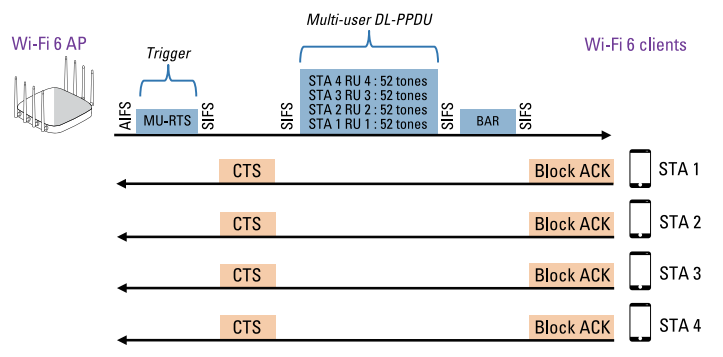

接下来分析一下触发帧（Trigger Frames）机制是如何用户DL-OFDMA通信，即802.11ax AP向802.11ax终端们进行多用户下行传输。

首先，802.11ax AP需要通过竞争（即CSMA/CA的竞争过程），竞争胜利后，其发起一个TXOP传输时间，相当于这一段TXOP时间内，信道都是被AP所预约占据的，其余所有节点都会被延迟。如上图所示，一旦802.11ax AP获得了TXOP传输时间，AP可以给多个目标终端发送MU-RTS帧，这也是一种类型的触发帧。该MU-RTS帧有以下两个目的：

- **预约信道（Reserve the medium）**：MU-RTS采用传统的OFDM技术，在整个20MHz信道上进行传输，所有的节点（包含802.11ax节点和传统的802.11节点）都可以接收。其功能和传统的RTS是类似的。通过该MU-RTS帧中的Duration/ID字段，该帧设置其余所有节点的NAV定时器，在预约时间内（即定时器设置的时间），所有的终端都处于被动接收状态，不会主动竞争信道。NAV定时器设置的时间值用于DL-OFDMA的数据帧交换。在802.11ax AP向802.11ax终端之间进行OFDMA传输时，信道是必须保证空闲的。
- **RU分配（RU allocation）**：MU-RTS还被用来同步802.11终端的RU分配。MU-RTS由于是一种触发帧（Trigger Frames），触发帧内部包含了RU分配对应的字段。802.11ax AP通过MU-RTS作为触发帧，告诉每一个终端其被分配的时频资源（即对应的RU）。当接收到MU-RTS后，终端需要向AP反馈CTS用于确认。

当收到来自于802.11ax终端的CTS后，802.11ax AP将执行一次下行的OFDMA数据传输（如图，即传输Multi-user DL-PPDU部分）。由于AP已经将信道划分成了多个RU，当终端在自己对应的RU上接收数据，并校验成功后，其需要向AP反馈ACK。该ACK还是通过Block-ACK的形式进行反馈的。具体为当传输完成后，AP会等待SIFS时间，然后发送BAR帧（Block ACK Request）向节点请求Block-ACK，然后终端并行反馈Block-ACK。这里反馈ACK还可以采用Automatic Block-ACK（即AutoBA，Auto Block-Ack ）机制。

> 注：在以上传输过程中，CTS和Block-ACK都是并行传输的，这里并行传输实际上还是利用到了MU传输的机制。

当本轮的DL-OFDMA传输完成后，所有节点（包含AP和终端）都需要进行下一次竞争。若802.11ax AP竞争成功，那么可以执行新的一次DL-OFDMA传输。若802.11n/ac的终端竞争成功，那么会执行一次传统的OFDM传输，以此类推。

# UL-OFDMA接入机制

## 序言

在802.11ax以前，协议仅仅支持过下行的多用户接入，比如说MU-MIMO技术（在802.11ac中仅仅支持下行），为了进一步增加并发传输的能力，在802.11ax中引入了上行OFDMA技术和上行的MU-MIMO接入。在协议中上行OFDMA和上行MU-MIMO是组合出现的，其是采用同一种接入思想，区别只在于触发帧内的参数以及数据帧的物理层头部上，本文仅介绍上行OFDMA接入机制。

参考资料：[Wi-Fi_6_FD_Extreme_Networks_Special_Edition](/books/Wi-Fi_6_FD_Extreme_Networks_Special_Edition.pdf)

## 上行OFDMA和PCF的区别

在802.11ax中，UL-OFDMA的接入机制也是基于触发帧（Trigger Frames）的，这一种机制和传统802.11中的PCF机制有一些类似，但是也有点区别。

在传统的802.11标准中定义了一种PCF工作模式（Point Coordination Function），该模式是一种基于轮询的工作模式。AP执行轮询者的角色（point coordinator ），其可以在CFP时间范围内（contention-free period ），轮询客户端并执行上下行的传输。在PCF之后，802.11e修正案中为了整体解决无线网络中QoS的问题，定义了一种HCCA的方式（HCF Controlled Channel Access）。在HCCA中，AP作为具有QoS的中心调度器（Hybrid Coordinator ，HC），其在接入网络时默认具有比较高的优先级。利用该优先级，其可以将TXOP分给自身或者其他的节点，以提供一个受控的接入时间段，该时间段也被称为CAP时间（Controlled Access Phase ）。在这段时间内，QoS数据可以无需竞争，直接传输。PCF以及HCCA直至目前也很少在实际产品中实现过，有传言指该机制有可能会在将来的802.11标准中被逐步淘汰。

在802.11ax中，AP可以控制信道并调度上行OFDMA（UL-OFDMA）的接入。这一种控制和PCF或者HCCA时有区别的。基于CSMA/CA的竞争规则在UL-OFDMA中还是使用的，**只有当802.11ax AP首先竞争胜利，并开启一个TXOP时间之后，其才可以占据并调度信道上其他的节点执行UL-OFDMA**。在UL-OFDMA中，也会类似HCCA一样轮询终端的buffer情况以及其对应数据的QoS情况，但是和HCCA的区别在于，HCCA是主动轮询的，而802.11ax终端可以隐式的反馈其缓存的信息，无需主动轮询。另外还有一点区别在于802.11ax中引入了资源分配，即**AP还需要为UL-OFDMA调度的时候，为多用户分配分配RU资源**。在UL-OFDMA传输之前，AP会通过触发帧来指示每一个终端其对应的RU资源，以及对应RU资源上的传输模式（包含空间流数量，MCS速率等）。

## 上行OFDMA接入机制（UL-OFDMA）

下面介绍上行OFDMA的工作机制（UL-OFDMA），其基本思想是802.11ax AP通过竞争获取信道后，发起一次TXOP传输时间，并在该时间内通过触发帧调度对应的节点进行并发的上行OFDMA传输。具体过程中UL-OFDMA比DL-OFDMA更为复杂一些，其会采用三个触发帧进行交互，每个触发帧都是AP向节点获取特定的信息反馈。UL-OFDMA中AP会要求终端反馈缓存情况（即Buffer Status Report, BSR）。BSR中包含了终端缓存数据的多少以及对应的QoS类别信息，这些信息会帮助AP优化RU的资源分配。AP将利用这些信息分配对应的RU，上行传输的时间，以及终端传输时对应的速率和功率。BSR信息是可以AP轮询请求的，也可以是非请求（也就是隐式反馈的）。

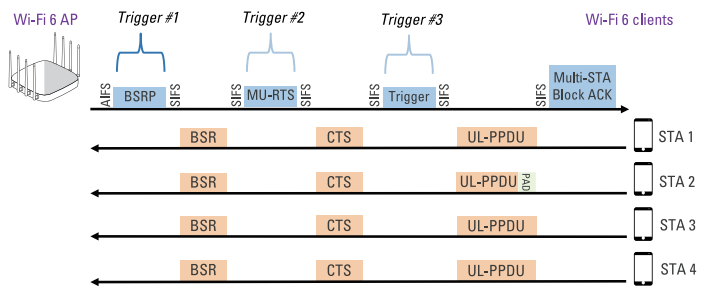

以上图作为示例简单说明，当802.11ax竞争成功后，其首先会发送第一个触发帧（即Trigger #1），该触发帧类型是BSRP（Buffer Status Report Poll ），其用于请求终端的Buffer信息。当终端收到BSRP以后，其会反馈BSR（Buffer Status Reports）信息，就如之前我们提到的，该信息用于辅助AP进行UL-OFDMA中RU资源的分配。

当BSRP,BSR交互后，如果网络中存在传统的802.11客户端，那么AP还需要发送MU-RTS帧（即Trigger #2），该帧也是一种触发帧，并采用传统的OFDM技术进行发送，所有的终端（包含802.11ax和非802.11ax）都可以接收。非802.11ax的终端会通过接收MU-RTS帧中的Duration/ID字段，设置本地的NAV计时器，以保证在剩余UL-OFDMA时间内不会发起主动竞争。同时该MU-RTS帧中还包含了RU资源分配内容。

> AP进行RU资源分配是在MU-RTS帧，而下一个触发帧仅仅是指示开启传输的作用。因为在AP分配RU资源后，需要得到终端的反馈，即终端会反馈CTS帧，告知AP其认可并知道了当前资源分配的情况。

当MU-RTS，CTS交换完后，AP会发送第三个触发帧（即Triiger #3），通知终端在对应的RU资源上进行上行传输，该触发帧还指示了本次上行传输的时间。

> 一次UL-OFDMA需要所有节点同时开始和同时结束（如果存在不同步的情况，那么需要在数据帧添加PAD用以填充，如图上STA2所示）。

该触发帧还包含了节点对应的功率控制信息，以便终端增加或者减少发送功率，这样有利于多终端均衡接收，并提高接收信号的质量。当上行UL-OFDMA传输完成后，AP会向终端们反馈Multi-STA Block ACK确认。另外，AP也可以逐个客户端反馈Block ACK，这在协议中是可选的。

> 并不是所有的上行链路传输需要三个触发帧，仅仅出于对传统客户端的保护机制的目的才需要MU-RTS触发帧。

