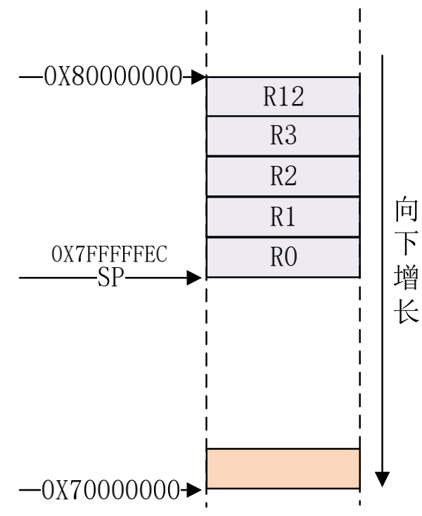
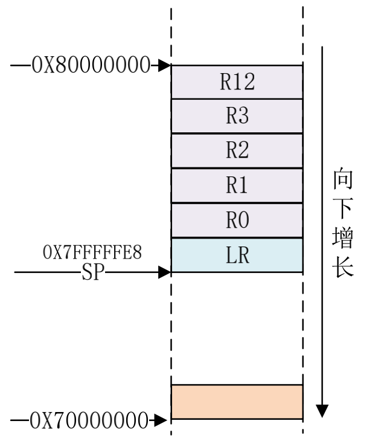
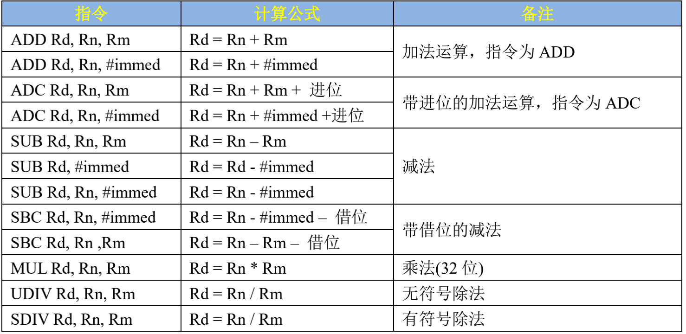
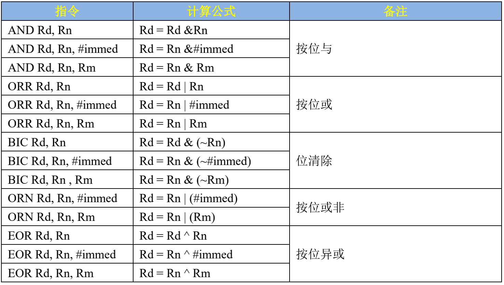

# 汇编基本格式

```
label：instruction @ comment
```

**label** 即标号，表示地址位置，有些指令前面可能会有标号，这样就可以通过这个标号得到指令的地址，标号也可以用来表示数据地址。注意 label 后面的“：”，任何以“：”结尾的标识符都会被识别为一个标号。

**instruction** 即指令，也就是汇编指令或伪指令。

**@**符号，表示后面的是注释，就跟 C 语言里面的“/*”和“*/”一样，其实在 GNU 汇编文件中我们也可以使用**“/*”**和**“*/”**来注释。

**comment** 就是注释内容。

比如如下代码：

```
add:
	MOVS R0, #0X12 @设置 R0=0X12
```

上面代码中“add:”就是标号，“MOVS R0,#0X12”就是指令，最后的“@设置 R0=0X12”就是注释。

> 注意！ARM 中的指令、伪指令、伪操作、寄存器名等可以全部使用大写，也可以全部使用小写，但是不能大小写混用。


# 汇编段

用户可以使用.section 伪操作来定义一个段，汇编系统预定义了一些段名。

|  段名   |       备注       |
| :-----: | :--------------: |
|  .text  |      代码段      |
|  .data  |  初始化的数据段  |
|  .bss   | 未初始化的数据段 |
| .rodata |    只读数据段    |

也可以使用.section 来定义一个段，每个段以段名开始，以下一段名或者文件结尾结束，比如：

```
.section .testsection @定义一个 testsetcion 段
```

汇编程序的默认入口标号是 **_start**，不过我们也可以在链接脚本中使用 ENTRY 来指明其它的入口点，下面的代码就是使用**_start** 作为入口标号：

```
.global _start 
_start:
	ldr r0, =0x12 @r0=0x12
```

上面代码中.global 是伪操作，表示_start 是一个全局标号，类似 C 语言里面的全局变量一样，常见的伪操作有：

|  段名   |                             备注                             |
| :-----: | :----------------------------------------------------------: |
|  .byte  |                定义单字节数据，比如.byte 0x12                |
| .short  |              定义双字节数据，比如.short 0x1234               |
|  .long  |          定义一个 4 字节数据，比如.long 0x12345678           |
|  .equ   | 赋值语句，格式为：.equ 变量名，表达式，比如.equ num, 0x12，表示 num=0x12 |
| .align  |         数据字节对齐，比如：.align 4 表示 4 字节对齐         |
|  .end   |                        表示源文件结束                        |
| .global | 定义一个全局符号，格式为：.global symbol，比如：.global _start |

GNU 汇编还有其它的伪操作，但是最常见的就是上面这些，如果想详细的了解全部的伪操作，可以参考《ARM Cortex-A(armV7)编程手册 V4.0.pdf》的 57 页

# 函数

GNU 汇编同样也支持函数，函数格式如下：

```
函数名:
	函数体
	返回语句
```

GNU 汇编函数返回语句不是必须的，如下代码就是用汇编写的 Cortex-A7 中断服务函数：

```
/* 未定义中断 */
Undefined_Handler:
	ldr r0, =Undefined_Handler
	bx r0
	
/* SVC 中断 */
SVC_Handler:
	ldr r0, =SVC_Handler
	bx r0
	
/* 预取终止中断 */
PrefAbort_Handler:
	ldr r0, =PrefAbort_Handler 
	bx r0
```

上述代码中定义了三个汇编函数：Undefined_Handler、SVC_Handler 和PrefAbort_Handler。以函数 Undefined_Handler 为例我们来看一下汇编函数组成，“Undefined_Handler”就是函数名，“ldr r0, =Undefined_Handler”是函数体，“bx r0”是函数返回语句，“bx”指令是返回指令，函数返回语句不是必须的。

# 常用汇编指令

本节我们将介绍一些常用的 Cortex-A7 汇编指令，如果想系统的了解 Cortex-A7 的所有汇编指令请参考《ARM ArchitectureReference Manual ARMv7-A and ARMv7-R edition.pdf》的 A4章节。

## 处理器内部数据传输指令

①、将数据从一个寄存器传递到另外一个寄存器。

②、将数据从一个寄存器传递到特殊寄存器，如 CPSR 和 SPSR 寄存器。

③、将立即数传递到寄存器。

数据传输常用的指令有三个：MOV、MRS 和 MSR，这三个指令的用法如表所示：

| 指令 | 目的 | 源   | 描述                                       |
| ---- | ---- | ---- | ------------------------------------------ |
| MOV  | R0   | R1   | 将 R1 里面的数据复制到 R0 中               |
| MRS  | R0   | CPRS | 将特殊寄存器 CPSR 里面的数据复制到 R0 中   |
| MSR  | CPRS | R0   | 将 R1 里面的数据复制到特殊寄存器 CPSR 里中 |

### **MOV** 指令

MOV 指令用于将数据从一个寄存器拷贝到另外一个寄存器，或者将一个立即数传递到寄存器里面，使用示例如下：

```
MOV R0，R1       @将寄存器 R1 中的数据传递给 R0，即 R0=R1
MOV R0, #0X12    @将立即数 0X12 传递给 R0 寄存器，即 R0=0X12
```

### **MRS** 指令

MRS 指令用于将特殊寄存器(如 CPSR 和 SPSR)中的数据传递给通用寄存器，要读取特殊寄存器的数据只能使用 MRS 指令！使用示例如下：

```
MRS R0, CPSR    @将特殊寄存器 CPSR 里面的数据传递给 R0，即 R0=CPSR
```

### **MSR** 指令

MSR 指令和 MRS 刚好相反，MSR 指令用来将普通寄存器的数据传递给特殊寄存器，也就是写特殊寄存器，写特殊寄存器只能使用 MSR，使用示例如下：

```
MSR CPSR, R0     @将 R0 中的数据复制到 CPSR 中，即 CPSR=R0
```

## 存储器访问指令

ARM 不能直接访问存储器，比如 RAM 中的数据，I.MX6UL 中的寄存器就是 RAM 类型的，我们用汇编来配置 I.MX6UL 寄存器的时候需要借助存储器访问指令，一般先将要配置的值写入到 Rx(x=0~12)寄存器中，然后借助存储器访问指令将 Rx 中的数据写入到 I.MX6UL 寄存器中。读取 I.MX6UL 寄存器也是一样的，只是过程相反。常用的存储器访问指令有两种：LDR 和 STR，用法如表所示：

| 指令                   | 描述                                          |
| ---------------------- | --------------------------------------------- |
| LDR Rd, [Rn , #offset] | 从存储器 Rn+offset 的位置读取数据存放到 Rd 中 |
| STR Rd, [Rn, #offset]  | 将 Rd 中的数据写入到存储器中的 Rn+offset 位置 |

### LDR 指令

LDR 主要用于从存储加载数据到寄存器 Rx 中，LDR 也可以将一个立即数加载到寄存器 Rx中，LDR 加载立即数的时候要使用“=”，而不是“#”。

在嵌入式开发中，LDR 最常用的就是读取 CPU 的寄存器值，比如 I.MX6UL 有个寄存器 GPIO1_GDIR，其地址为 0X0209C004，我们现在要读取这个寄存器中的数据，示例代码如下：

```
LDR R0, =0X0209C004   @将寄存器地址 0X0209C004 加载到 R0 中，即 R0=0X0209C004
LDR R1, [R0]          @读取地址 0X0209C004 中的数据到 R1 寄存器中
```

上述代码就是读取寄存器 GPIO1_GDIR 中的值，读取到的寄存器值保存在 R1 寄存器中，上面代码中 offset 是 0，也就是没有用到 offset。

### STR 指令

LDR 是从存储器读取数据，STR 就是将数据写入到存储器中，同样以 I.MX6UL 寄存器 GPIO1_GDIR 为例，现在我们要配置寄存器 GPIO1_GDIR 的值为 0X20000002，示例代码如下:

```
LDR R0, =0X0209C004    @将寄存器地址 0X0209C004 加载到 R0 中，即 R0=0X0209C004
LDR R1, =0X20000002    @R1 保存要写入到寄存器的值，即 R1=0X20000002
STR R1, [R0]           @将 R1 中的值写入到 R0 中所保存的地址中
```

LDR 和 STR 都是按照字进行读取和写入的，也就是操作的 32 位数据，如果要按照字节、半字进行操作的话可以在指令“LDR”后面加上 B 或 H，比如按字节操作的指令就是 LDRB 和 STRB，按半字操作的指令就是 LDRH 和 STRH。

### 压栈和出栈指令

我们通常会在 A 函数中调用 B 函数，当 B 函数执行完以后再回到 A 函数继续执行。要想再跳回 A 函数以后代码能够接着正常运行，那就必须在跳到 B 函数之前将当前处理器状态保存起来(就是保存 R0~R15 这些寄存器值)，当 B 函数执行完成以后再用前面保存的寄存器值恢复R0~R15 即可。保存 R0~R15 寄存器的操作就叫做现场保护，恢复 R0~R15 寄存器的操作就叫做恢复现场。在进行现场保护的时候需要进行压栈(入栈)操作，恢复现场就要进行出栈操作。压栈的指令为 PUSH，出栈的指令为 POP，PUSH 和 POP 是一种多存储和多加载指令，即可以一次操作多个寄存器数据，他们利用当前的栈指针 SP 来生成地址，PUSH 和 POP 的用法如表所示：

| 指令            | 描述                 |
| --------------- | -------------------- |
| PUSH <reg list> | 将寄存器列表存入栈中 |
| POP <reg list>  | 从栈中恢复寄存器列表 |

假如我们现在要将 R0~R3 和 R12 这 5 个寄存器压栈，当前的 SP 指针指向 0X80000000，处理器的堆栈是向下增长的，使用的汇编代码如下：

```
PUSH {R0~R3, R12}     @将 R0~R3 和 R12 压栈
```



上图就是对R0~R3,R12进行压栈以后的堆栈示意图，此时的SP指向了0X7FFFFFEC，假如我们现在要再将 LR 进行压栈，汇编代码如下：

```
PUSH {LR}           @将 LR 进行压栈
```



上图就是分两步对 R0~R3,R12 和 LR 进行压栈以后的堆栈模型，如果我们要出栈的话就是使用如下代码：

```
POP {LR}              @先恢复 LR 
POP {R0~R3,R12}       @再恢复 R0~R3,R12
```

出栈的就是从栈顶，也就是 SP 当前执行的位置开始，地址依次减小来提取堆栈中的数据到要恢复的寄存器列表中。PUSH 和 POP 的另外一种写法是“STMFD SP！”和“LDMFD SP!”，因此上面的汇编代码可以改为：

```
STMFD SP!, {R0~R3, R12}    @R0~R3,R12 入栈
STMFD SP!, {LR}            @LR 入栈 34 
LDMFD SP!, {LR}            @先恢复 LR
LDMFD SP!, {R0~R3, R12}    @再恢复 R0~R3, R12
```

STMFD 可以分为两部分：STM 和 FD，同理，LDMFD 也可以分为 LDM 和 FD。看到 STM和 LDM 有没有觉得似曾相识，前面讲了 LDR 和 STR，这两个是数据加载和存储指令，但是每次只能读写存储器中的一个数据。STM 和 LDM 就是多存储和多加载，可以连续的读写存储器中的多个连续数据。

FD 是 Full Descending 的缩写，即满递减的意思。根据 ATPCS 规则,ARM 使用的 FD 类型的堆栈，SP 指向最后一个入栈的数值，堆栈是由高地址向下增长的，也就是前面说的向下增长的堆栈，因此最常用的指令就是 STMFD 和 LDMFD。STM 和 LDM 的指令寄存器列表中编号小的对应低地址，编号高的对应高地址。

## 跳转指令

有多种跳转操作，比如：

①、直接使用跳转指令 B、BL、BX 等。

②、直接向 PC 寄存器里面写入数据。

上述两种方法都可以完成跳转操作，但是一般常用的还是 B、BL 或 BX

| 指令       | 描述                                                         |
| ---------- | ------------------------------------------------------------ |
| B <label>  | 跳转到 label，如果跳转范围超过了+/-2KB，可以指定 B.W <label>使用 32 位版本的跳转指令， 这样可以得到较大范围的跳转 |
| BX <Rm>    | 间接跳转，跳转到存放于 Rm 中的地址处，并且切换指令集         |
| BL <label> | 跳转到标号地址，并将返回地址保存在 LR 中。                   |
| BLX <Rm>   | 结合 BX 和 BL 的特点，跳转到 Rm 指定的地址，并将返回地址保存在 LR 中，切换指令集 |

我们重点来看一下 B 和 BL 指令，因为这两个是我们用的最多的，如果要在汇编中进行函数调用使用的就是 B 和 BL 指令：

### B 指令

这是最简单的跳转指令，B 指令会将 PC 寄存器的值设置为跳转目标地址， 一旦执行 B 指令，ARM 处理器就会立即跳转到指定的目标地址。如果要调用的函数不会再返回到原来的执行处，那就可以用 B 指令，如下示例：

```
_start: 

	ldr sp,=0X80200000  @设置栈指针
	b main              @跳转到 main 函数
```

上述代码就是典型的在汇编中初始化 C 运行环境，然后跳转到 C 文件的 main 函数中运行，上述代码只是初始化了 SP 指针，有些处理器还需要做其他的初始化，比如初始化 DDR 等等。因为跳转到 C 文件以后再也不会回到汇编了，所以在第 4 行使用了 B 指令来完成跳转。

### BL 指令

BL 指令相比 B 指令，在跳转之前会在寄存器 LR(R14)中保存当前 PC 寄存器值，所以可以通过将 LR 寄存器中的值重新加载到 PC 中来继续从跳转之前的代码处运行，这是子程序调用一个基本但常用的手段。比如 Cortex-A 处理器的 irq 中断服务函数都是汇编写的，主要用汇编来实现现场的保护和恢复、获取中断号等。但是具体的中断处理过程都是 C 函数，所以就会存在汇编中调用 C 函数的问题。而且当 C 语言版本的中断处理函数执行完成以后是需要返回到 irq 汇编中断服务函数，因为还要处理其他的工作，一般是恢复现场。这个时候就不能直接使用B 指令了，因为 B 指令一旦跳转就再也不会回来了，这个时候要使用 BL 指令，示例代码如下：

```
push {r0, r1}          @保存 r0,r1
cps #0x13              @进入 SVC 模式，允许其他中断再次进去

bl system_irqhandler   @加载 C 语言中断处理函数到 r2 寄存器中

cps #0x12              @进入 IRQ 模式
pop {r0, r1}
str r0, [r1, #0X10]    @中断执行完成，写 EOIR
```

## 算数运算指令



在嵌入式开发中最常会用的就是加减指令，乘除基本用不到

## 逻辑运算指令

我们用 C 语言进行 CPU 寄存器配置的时候常常需要用到逻辑运算符号，比如“&”、“|”等逻辑运算符。使用汇编语言的时候也可以使用逻辑运算指令，常用的运算指令用法如表所示：



逻辑运算指令都很好理解，后面时候汇编配置 I.MX6UL 的外设寄存器的时候可能会用到，ARM 汇编就讲解到这里，本节主要讲解了一些最常用的指令，还有很多不常用的指令没有讲解，但是够我们后续学习用了。要想详细的学习 ARM 的所有指令请参考《 ARM ArchitectureReference Manual ARMv7-A and ARMv7-R edition.pdf》和《ARM Cortex-A(armV7)编程手册 V4.0.pdf》这两份文档。

